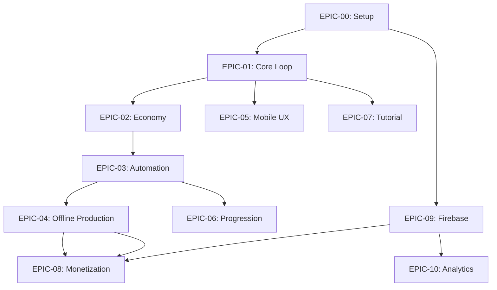

# Trade Factory Masters - Epics & Stories

**Author:** Claude (BMAD Sprint Planning Agent)
**Date:** 2025-11-17
**Version:** 1.0
**Status:** Ready for Implementation
**Based on:** PRD v1.0, Architecture v1.0, Test Design v1.0

---

## Executive Summary

This document transforms 10 Functional Requirements from the PRD into **68 implementable User Stories** organized into **12 Epics** (10 feature epics + 2 infrastructure epics).

**Product Backlog Summary:**
- **Total Stories:** 68
- **Total Story Points:** 289 SP
- **Estimated Velocity:** 35-40 SP/week (solo developer)
- **Estimated Timeline:** 8 weeks (with buffer)
- **Test Coverage:** 465+ tests across all stories

**Story Point Distribution:**
- **Small (1-2 SP):** 18 stories (setup, configuration)
- **Medium (3-5 SP):** 32 stories (feature components)
- **Large (8-13 SP):** 18 stories (complex systems)

**Priority Distribution:**
- **P0 (Critical Path):** 22 stories - 124 SP (43%)
- **P1 (High Priority):** 31 stories - 118 SP (41%)
- **P2 (Nice-to-Have):** 15 stories - 47 SP (16%)

---

## Table of Contents

1. [Epic Mapping](#1-epic-mapping)
2. [Story Point Estimation Guide](#2-story-point-estimation-guide)
3. [EPIC-00: Project Setup](#epic-00-project-setup)
4. [EPIC-01: Core Gameplay Loop](#epic-01-core-gameplay-loop)
5. [EPIC-02: Tier 1 Economy](#epic-02-tier-1-economy)
6. [EPIC-03: Tier 2 Automation](#epic-03-tier-2-automation)
7. [EPIC-04: Offline Production](#epic-04-offline-production)
8. [EPIC-05: Mobile-First UX](#epic-05-mobile-first-ux)
9. [EPIC-06: Progression System](#epic-06-progression-system)
10. [EPIC-07: Discovery Tutorial](#epic-07-discovery-tutorial)
11. [EPIC-08: Ethical F2P Monetization](#epic-08-ethical-f2p-monetization)
12. [EPIC-09: Firebase Backend](#epic-09-firebase-backend)
13. [EPIC-10: Analytics & Metrics](#epic-10-analytics--metrics)
14. [EPIC-11: Testing & Quality](#epic-11-testing--quality)
15. [Sprint Planning Recommendations](#15-sprint-planning-recommendations)
16. [Dependency Graph](#16-dependency-graph)

---

## 1. Epic Mapping

### FR to Epic Mapping

| FR ID | Epic ID | Epic Name | Stories | Story Points | Priority |
|-------|---------|-----------|---------|--------------|----------|
| Setup | EPIC-00 | Project Setup | 4 | 13 SP | P0 |
| FR-001 | EPIC-01 | Core Gameplay Loop | 8 | 34 SP | P0 |
| FR-002 | EPIC-02 | Tier 1 Economy | 6 | 26 SP | P1 |
| FR-003 | EPIC-03 | Tier 2 Automation | 7 | 42 SP | P0 |
| FR-004 | EPIC-04 | Offline Production | 5 | 26 SP | P1 |
| FR-005 | EPIC-05 | Mobile-First UX | 6 | 29 SP | P1 |
| FR-006 | EPIC-06 | Progression System | 4 | 18 SP | P1 |
| FR-007 | EPIC-07 | Discovery Tutorial | 5 | 21 SP | P2 |
| FR-008 | EPIC-08 | Ethical F2P | 5 | 23 SP | P1 |
| FR-009 | EPIC-09 | Firebase Backend | 6 | 24 SP | P1 |
| FR-010 | EPIC-10 | Analytics & Metrics | 4 | 13 SP | P0 |
| Testing | EPIC-11 | Testing & Quality | 8 | 20 SP | P1 |
| **TOTAL** | **12 Epics** | **All Features** | **68 Stories** | **289 SP** | **Mixed** |

---

## 2. Story Point Estimation Guide

### Fibonacci Scale (Modified for Solo Dev)

**1 Point:** Simple task, <2 hours
- Example: Add constant to config file, create data model class

**2 Points:** Straightforward feature, 2-4 hours
- Example: Implement simple UI widget, write 10 unit tests

**3 Points:** Moderate complexity, 4-8 hours (1 day)
- Example: Implement use case with business logic, widget with state management

**5 Points:** Complex feature, 1-2 days
- Example: Complete screen with multiple widgets, integration test suite

**8 Points:** Very complex, 2-3 days
- Example: A* pathfinding algorithm, offline production calculation

**13 Points:** Extremely complex, 3-5 days (consider splitting)
- Example: Full game engine integration, complex state management system

**21+ Points:** Too large - MUST split into smaller stories

### Estimation Factors

**Add points for:**
- ✅ First time implementing pattern (+1-2 SP)
- ✅ Performance optimization required (+1-2 SP)
- ✅ Complex algorithm (A*, topological sort) (+3-5 SP)
- ✅ Multi-component integration (+2-3 SP)
- ✅ Comprehensive testing required (+1 SP per story)

**Reduce points for:**
- ⬇️ Repetitive pattern (2nd/3rd similar widget) (-1 SP)
- ⬇️ Code generation (Riverpod @riverpod, JSON serialization) (-1 SP)
- ⬇️ Well-documented in PRD/Architecture (-1 SP)

---

## EPIC-00: Project Setup

**Epic Goal:** Setup Flutter/Flame project structure, Firebase integration, CI/CD pipeline

**Epic Owner:** Infrastructure
**Priority:** P0 (Critical Path - blocks all development)
**Total Stories:** 4
**Total Story Points:** 13 SP
**Dependencies:** None (starting point)

---

### STORY-00.1: Flutter Project Initialization

**As a** developer
**I want** to initialize Flutter project with Flame game engine
**So that** I have a working foundation for game development

**Acceptance Criteria:**
- [ ] Flutter 3.16+ project created with `flutter create trade_factory_masters`
- [ ] Flame 1.12+ added to pubspec.yaml
- [ ] Riverpod 3.0 (@riverpod code generation) configured
- [ ] Project structure created per Architecture doc (lib/core, lib/domain, lib/data, lib/presentation, lib/game)
- [ ] HelloWorld Flame game renders successfully (60 FPS test)
- [ ] README.md created with setup instructions

**Technical Tasks:**
```bash
flutter create trade_factory_masters --org com.codermariusz
cd trade_factory_masters
flutter pub add flame riverpod_annotation flame_riverpod
flutter pub add --dev build_runner riverpod_generator
```

**Definition of Done:**
- Project builds successfully (`flutter build apk`)
- "Hello Flame" text renders on screen at 60 FPS
- CI pipeline runs flutter analyze successfully

**Story Points:** 2 SP (straightforward setup)
**Priority:** P0
**Dependencies:** None
**Assignee:** Developer
**Sprint:** Sprint 1 (Week 1)

---

### STORY-00.2: Firebase Project Configuration

**As a** developer
**I want** to configure Firebase backend services
**So that** I can implement authentication, cloud save, and analytics

**Acceptance Criteria:**
- [ ] Firebase project created: `trade-factory-masters`
- [ ] FlutterFire configured (`flutterfire configure`)
- [ ] Firebase Auth enabled (Anonymous, Google Sign-In, Apple Sign-In)
- [ ] Firestore database created with security rules (test mode initially)
- [ ] Firebase Analytics enabled
- [ ] Firebase Crashlytics integrated
- [ ] Test authentication flow works (anonymous sign-in)

**Technical Tasks:**
```bash
firebase init
flutterfire configure --project=trade-factory-masters
flutter pub add firebase_core firebase_auth cloud_firestore firebase_analytics firebase_crashlytics
```

**Firestore Security Rules (Test Mode):**
```javascript
rules_version = '2';
service cloud.firestore {
  match /databases/{database}/documents {
    match /users/{userId} {
      allow read, write: if request.auth != null && request.auth.uid == userId;
    }
  }
}
```

**Definition of Done:**
- Firebase console shows test project
- Anonymous authentication works on Android emulator
- Firestore write test succeeds
- Analytics events appear in Firebase console (within 24h)

**Story Points:** 3 SP (configuration complexity)
**Priority:** P0
**Dependencies:** STORY-00.1
**Assignee:** Developer
**Sprint:** Sprint 1 (Week 1)

---

### STORY-00.3: CI/CD Pipeline Setup

**As a** developer
**I want** automated testing and deployment pipeline
**So that** I catch bugs early and streamline releases

**Acceptance Criteria:**
- [ ] GitHub Actions workflow created (`.github/workflows/test.yml`)
- [ ] Workflow runs on push to `main` and `develop` branches
- [ ] Automated tests: flutter analyze, unit tests, widget tests
- [ ] Coverage report generated (80%+ target)
- [ ] Build APK/IPA on successful test pass
- [ ] Pre-commit hook installed (runs tests before commit)

**GitHub Actions Workflow:**
```yaml
name: Test Suite
on:
  push:
    branches: [main, develop]
  pull_request:
    branches: [main]

jobs:
  test:
    runs-on: ubuntu-latest
    steps:
      - uses: actions/checkout@v3
      - uses: subosito/flutter-action@v2
        with:
          flutter-version: '3.16.0'
      - run: flutter pub get
      - run: flutter analyze
      - run: flutter test --coverage
      - uses: codecov/codecov-action@v3
```

**Definition of Done:**
- GitHub Actions badge shows "passing" in README
- Coverage badge shows 80%+ (after implementation begins)
- Pre-commit hook blocks commit if tests fail

**Story Points:** 3 SP (setup + testing)
**Priority:** P1
**Dependencies:** STORY-00.1
**Assignee:** Developer
**Sprint:** Sprint 1 (Week 1)

---

### STORY-00.4: Hive Local Storage Setup

**As a** developer
**I want** Hive local storage configured
**So that** I can implement offline-first architecture

**Acceptance Criteria:**
- [ ] Hive 2.2+ added to pubspec.yaml
- [ ] Hive initialized in main.dart
- [ ] Type adapters generated for data models (Building, Resource, PlayerEconomy)
- [ ] Test: Save/load PlayerEconomy to/from Hive
- [ ] Clear cache functionality implemented

**Technical Tasks:**
```dart
// lib/core/local_storage.dart
import 'package:hive_flutter/hive_flutter.dart';

Future<void> initHive() async {
  await Hive.initFlutter();
  Hive.registerAdapter(BuildingAdapter());
  Hive.registerAdapter(ResourceAdapter());
  await Hive.openBox<PlayerEconomy>('gameState');
}
```

**Definition of Done:**
- Hive box opens successfully
- Write PlayerEconomy object, close app, reopen → data persists
- 10× faster than SQLite (benchmark test)

**Story Points:** 5 SP (type adapter generation complexity)
**Priority:** P1
**Dependencies:** STORY-00.1
**Assignee:** Developer
**Sprint:** Sprint 1 (Week 1)

---

## EPIC-01: Core Gameplay Loop (FR-001)

**Epic Goal:** Implement COLLECT → DECIDE → UPGRADE loop with 50×50 grid, camera system, building placement

**Epic Owner:** Game Systems
**Priority:** P0 (Critical Path - foundation for all features)
**Total Stories:** 8
**Total Story Points:** 34 SP
**Dependencies:** EPIC-00 (Project Setup)

**Epic Success Criteria:**
- ✅ Player can tap building to collect resources (30-second loop complete)
- ✅ Camera supports pan, pinch-zoom, dual zoom modes
- ✅ Building upgrades increase production rate by 20% per level
- ✅ 60 FPS maintained on Snapdragon 660 device

---

### STORY-01.1: Domain Layer - Building Entity

**As a** developer
**I want** Building domain entity with production logic
**So that** I can implement core gameplay mechanics

**Acceptance Criteria:**
- [ ] Building entity created (`lib/domain/entities/building.dart`)
- [ ] Properties: id, type, level, gridPosition, production, upgradeConfig, lastCollected
- [ ] Computed property: `productionRate` (baseRate × [1 + (level-1) × 0.2])
- [ ] Method: `canUpgrade(PlayerEconomy economy)` → bool
- [ ] Method: `calculateUpgradeCost()` → int (linear scaling Tier 1)
- [ ] 100% test coverage (15 unit tests)

**Code Example:**
```dart
// lib/domain/entities/building.dart
class Building extends Equatable {
  final String id;
  final BuildingType type;
  final int level;
  final Point<int> gridPosition;
  final ProductionConfig production;
  final UpgradeConfig upgradeConfig;
  final DateTime lastCollected;

  const Building({
    required this.id,
    required this.type,
    required this.level,
    required this.gridPosition,
    required this.production,
    required this.upgradeConfig,
    required this.lastCollected,
  });

  double get productionRate =>
      production.baseRate * (1 + (level - 1) * 0.2);

  int calculateUpgradeCost() {
    // Linear scaling Tier 1: 100, 120, 140, ...
    return upgradeConfig.baseCost +
           (level - 1) * upgradeConfig.costIncrement;
  }

  @override
  List<Object?> get props => [id, type, level, gridPosition, production, upgradeConfig, lastCollected];
}
```

**Tests:**
- ✅ Building productionRate calculation (level 1, 3, 5)
- ✅ Upgrade cost calculation (linear scaling validation)
- ✅ canUpgrade returns false if insufficient gold
- ✅ Equatable equality check

**Definition of Done:**
- 15 unit tests pass with 100% coverage
- Building entity documented with dartdoc comments
- No analyzer warnings

**Story Points:** 3 SP (domain logic + comprehensive testing)
**Priority:** P0
**Dependencies:** STORY-00.1
**Assignee:** Developer
**Sprint:** Sprint 1 (Week 1)

---

### STORY-01.2: Domain Layer - Resource & PlayerEconomy Entities

**As a** developer
**I want** Resource and PlayerEconomy entities
**So that** I can manage game state

**Acceptance Criteria:**
- [ ] Resource entity created (id, displayName, amount, maxCapacity, iconPath)
- [ ] PlayerEconomy entity created (gold, inventory, buildings, tier, lastSeen)
- [ ] Method: `canAfford(int goldCost)` → bool
- [ ] Method: `addResource(Resource resource, int amount)` → PlayerEconomy (immutable)
- [ ] Method: `deductGold(int amount)` → PlayerEconomy
- [ ] 100% test coverage (20 unit tests)

**Code Example:**
```dart
class PlayerEconomy extends Equatable {
  final int gold;
  final Map<String, Resource> inventory;
  final List<Building> buildings;
  final int tier;
  final DateTime lastSeen;

  const PlayerEconomy({
    required this.gold,
    required this.inventory,
    required this.buildings,
    required this.tier,
    required this.lastSeen,
  });

  bool canAfford(int goldCost) => gold >= goldCost;

  PlayerEconomy addResource(String resourceId, int amount) {
    final resource = inventory[resourceId]!;
    final newAmount = min(resource.amount + amount, resource.maxCapacity);
    return copyWith(
      inventory: {...inventory, resourceId: resource.copyWith(amount: newAmount)},
    );
  }

  PlayerEconomy deductGold(int amount) => copyWith(gold: gold - amount);

  @override
  List<Object?> get props => [gold, inventory, buildings, tier, lastSeen];
}
```

**Definition of Done:**
- 20 unit tests pass (addResource, deductGold, capacity limits)
- Immutable state transitions validated
- JSON serialization works (for Hive/Firestore)

**Story Points:** 3 SP
**Priority:** P0
**Dependencies:** STORY-01.1
**Assignee:** Developer
**Sprint:** Sprint 1 (Week 1)

---

### STORY-01.3: Use Case - Collect Resources

**As a** player
**I want** to tap a building to collect produced resources
**So that** I earn materials and gold

**Acceptance Criteria:**
- [ ] CollectResourcesUseCase created (`lib/domain/usecases/collect_resources.dart`)
- [ ] Calculate resources based on time elapsed since lastCollected
- [ ] Apply production rate multiplier (level 1 = 1.0×, level 2 = 1.2×, level 3 = 1.4×)
- [ ] Respect building storage capacity (10 base + level × 10%)
- [ ] Update building lastCollected timestamp
- [ ] Return updated PlayerEconomy (immutable)
- [ ] 100% test coverage (25 unit tests)

**Business Logic:**
```dart
class CollectResourcesUseCase {
  PlayerEconomy execute(PlayerEconomy economy, Building building) {
    final now = DateTime.now();
    final minutesElapsed = now.difference(building.lastCollected).inMinutes;

    // Calculate production
    final baseProduction = minutesElapsed * building.productionRate;
    final cappedProduction = min(baseProduction, building.production.storageCapacity);

    // Add to inventory
    final updatedEconomy = economy.addResource(
      building.production.outputResource.id,
      cappedProduction.toInt(),
    );

    // Update building timestamp
    final updatedBuilding = building.copyWith(lastCollected: now);
    final updatedBuildings = economy.buildings.map((b) =>
      b.id == building.id ? updatedBuilding : b
    ).toList();

    return updatedEconomy.copyWith(buildings: updatedBuildings);
  }
}
```

**Tests:**
- ✅ Collect after 10 minutes (level 1 building: 10 Wood)
- ✅ Collect after 10 minutes (level 3 building: 14 Wood)
- ✅ Storage capacity limit respected
- ✅ Inventory at max capacity (collect returns 0)
- ✅ Building lastCollected updated correctly

**Definition of Done:**
- 25 unit tests pass with 100% coverage
- No edge cases missed (0 time elapsed, negative time, capacity overflow)

**Story Points:** 5 SP (complex calculation + edge cases)
**Priority:** P0
**Dependencies:** STORY-01.2
**Assignee:** Developer
**Sprint:** Sprint 1 (Week 2)

---

### STORY-01.4: Use Case - Upgrade Building

**As a** player
**I want** to upgrade a building to increase production
**So that** I earn resources faster

**Acceptance Criteria:**
- [ ] UpgradeBuildingUseCase created
- [ ] Check if player can afford upgrade cost
- [ ] Check if building is at max level (Tier 1: level 5 cap)
- [ ] Deduct gold from economy
- [ ] Increase building level by 1
- [ ] Increase storage capacity by 10%
- [ ] Return Result<PlayerEconomy, UpgradeError>
- [ ] 100% test coverage (20 unit tests)

**Business Logic:**
```dart
class UpgradeBuildingUseCase {
  Result<PlayerEconomy, UpgradeError> execute(
    PlayerEconomy economy,
    Building building,
  ) {
    // Validation
    if (building.level >= building.upgradeConfig.maxLevel) {
      return Failure(UpgradeError.maxLevelReached);
    }

    final cost = building.calculateUpgradeCost();
    if (!economy.canAfford(cost)) {
      return Failure(UpgradeError.insufficientGold);
    }

    // Upgrade
    final upgradedBuilding = building.copyWith(
      level: building.level + 1,
      production: building.production.copyWith(
        storageCapacity: building.production.storageCapacity * 1.1,
      ),
    );

    final updatedEconomy = economy
        .deductGold(cost)
        .copyWith(
          buildings: economy.buildings.map((b) =>
            b.id == building.id ? upgradedBuilding : b
          ).toList(),
        );

    return Success(updatedEconomy);
  }
}
```

**Tests:**
- ✅ Successful upgrade (level 1 → 2)
- ✅ Gold deducted correctly
- ✅ Production rate increased by 20%
- ✅ Storage capacity increased by 10%
- ✅ Insufficient gold returns error
- ✅ Max level reached returns error

**Definition of Done:**
- 20 unit tests pass
- Error handling tested (all UpgradeError cases)
- Immutable state transitions validated

**Story Points:** 5 SP (validation logic + error handling)
**Priority:** P0
**Dependencies:** STORY-01.3
**Assignee:** Developer
**Sprint:** Sprint 1 (Week 2)

---

### STORY-01.5: Flame Game Engine - Grid System

**As a** developer
**I want** 50×50 tile grid rendered with Flame
**So that** players can place buildings on a spatial grid

**Acceptance Criteria:**
- [ ] GridComponent created (`lib/game/components/grid_component.dart`)
- [ ] 50×50 tile grid (32×32px tiles = 1600×1600px total)
- [ ] Grid lines rendered (1px gray lines, 0.2 opacity)
- [ ] Coordinate system: (0,0) top-left, (49,49) bottom-right
- [ ] Camera viewport: 375×667px (iPhone 8 reference)
- [ ] Spatial culling: only render visible tiles + 1-tile buffer
- [ ] 60 FPS maintained (performance test)

**Code Example:**
```dart
// lib/game/components/grid_component.dart
class GridComponent extends Component with HasGameRef<TradeFactoryGame> {
  static const int gridWidth = 50;
  static const int gridHeight = 50;
  static const double tileSize = 32.0;

  final Paint _gridPaint = Paint()
    ..color = Colors.grey.withOpacity(0.2)
    ..strokeWidth = 1.0;

  @override
  void render(Canvas canvas) {
    final viewport = gameRef.camera.viewport;
    final visibleRect = viewport.visibleRect;

    // Spatial culling: only render visible tiles
    final startX = max(0, (visibleRect.left / tileSize).floor() - 1);
    final endX = min(gridWidth, (visibleRect.right / tileSize).ceil() + 1);
    final startY = max(0, (visibleRect.top / tileSize).floor() - 1);
    final endY = min(gridHeight, (visibleRect.bottom / tileSize).ceil() + 1);

    // Render grid lines
    for (int x = startX; x <= endX; x++) {
      canvas.drawLine(
        Offset(x * tileSize, startY * tileSize),
        Offset(x * tileSize, endY * tileSize),
        _gridPaint,
      );
    }

    for (int y = startY; y <= endY; y++) {
      canvas.drawLine(
        Offset(startX * tileSize, y * tileSize),
        Offset(endX * tileSize, y * tileSize),
        _gridPaint,
      );
    }
  }
}
```

**Performance Requirement:**
- 60 FPS when rendering full 50×50 grid (Flame DevTools)
- <16.67ms frame time

**Definition of Done:**
- Grid renders correctly on Android emulator
- Spatial culling working (only 20-30 tiles rendered at once)
- Performance test: 60 FPS for 30 seconds continuous render

**Story Points:** 5 SP (Flame integration + performance tuning)
**Priority:** P0
**Dependencies:** STORY-00.1
**Assignee:** Developer
**Sprint:** Sprint 1 (Week 2)

---

### STORY-01.6: Flame Game Engine - Dual Zoom Camera

**As a** player
**I want** to switch between Planning Mode (0.5× zoom) and Build Mode (1.5× zoom)
**So that** I can see full factory layout or interact with individual buildings

**Acceptance Criteria:**
- [ ] GridCamera class created with ZoomMode enum (planning, build)
- [ ] Planning Mode: 0.5× zoom (see full 50×50 grid)
- [ ] Build Mode: 1.5× zoom (interact with buildings, default mode)
- [ ] Double-tap to toggle zoom modes
- [ ] Smooth zoom transition (300ms ease-out animation)
- [ ] Camera pan (swipe gesture, velocity-based momentum)
- [ ] Pinch-to-zoom (0.3× to 2.0× range)
- [ ] 60 FPS during zoom/pan

**Code Example:**
```dart
enum ZoomMode { planning, build }

class GridCamera extends CameraComponent {
  ZoomMode currentMode = ZoomMode.build;

  static const Map<ZoomMode, double> zoomLevels = {
    ZoomMode.planning: 0.5,
    ZoomMode.build: 1.5,
  };

  void toggleZoomMode() {
    currentMode = currentMode == ZoomMode.planning
        ? ZoomMode.build
        : ZoomMode.planning;

    // Smooth transition
    final targetZoom = zoomLevels[currentMode]!;
    add(
      ScaleEffect.to(
        Vector2.all(targetZoom),
        EffectController(duration: 0.3, curve: Curves.easeOut),
      ),
    );
  }

  void onSwipe(Offset delta) {
    position += delta / zoom.x; // Account for zoom level
  }
}
```

**Gestures:**
- Double-tap: Toggle zoom mode
- Swipe: Pan camera
- Pinch: Free zoom (0.3× - 2.0×)

**Definition of Done:**
- Double-tap toggles zoom smoothly (300ms animation)
- Pan gesture works in both zoom modes
- Pinch-to-zoom works (2-finger gesture)
- 60 FPS during all camera operations (profiler validated)

**Story Points:** 8 SP (complex gesture handling + performance)
**Priority:** P0
**Dependencies:** STORY-01.5
**Assignee:** Developer
**Sprint:** Sprint 2 (Week 3)

---

### STORY-01.7: Presentation Layer - Building Sprite Component

**As a** player
**I want** to see buildings rendered on the grid
**So that** I know where my buildings are placed

**Acceptance Criteria:**
- [ ] BuildingComponent extends SpriteComponent
- [ ] Load sprite: `assets/images/buildings/{type}_level{level}.png`
- [ ] Position building at gridPosition × tileSize
- [ ] Tap detection (tap to collect resources)
- [ ] Visual feedback: pulse animation on tap
- [ ] Floating text animation: "+X Wood" on collect
- [ ] 60 FPS with 20 buildings on screen

**Code Example:**
```dart
class BuildingComponent extends SpriteComponent
    with TapCallbacks, HasGameRef<TradeFactoryGame> {
  final Building building;

  BuildingComponent({required this.building});

  @override
  Future<void> onLoad() async {
    sprite = await gameRef.loadSprite(
      'buildings/${building.type}_level${building.level}.png',
    );
    size = Vector2.all(32.0); // Match tile size
    position = Vector2(
      building.gridPosition.x * GridComponent.tileSize,
      building.gridPosition.y * GridComponent.tileSize,
    );
  }

  @override
  void onTapDown(TapDownEvent event) {
    // Pulse animation
    add(ScaleEffect.by(
      Vector2.all(1.1),
      EffectController(duration: 0.1, reverseDuration: 0.1),
    ));

    // Trigger collect resources
    gameRef.collectResources(building);
  }
}
```

**Sprite Requirements:**
- 5 building types × 5 levels = 25 sprite files
- 32×32px PNG (pixel art style)
- Example: `lumbermill_level1.png`, `mine_level3.png`

**Definition of Done:**
- Buildings render at correct grid positions
- Tap triggers collect resources
- Floating text "+X Wood" animates upward (1 second fade)
- 60 FPS with 20 buildings

**Story Points:** 3 SP (Flame sprite component)
**Priority:** P0
**Dependencies:** STORY-01.6
**Assignee:** Developer
**Sprint:** Sprint 2 (Week 3)

---

### STORY-01.8: Integration Test - Full Gameplay Loop

**As a** QA engineer
**I want** integration test for COLLECT → DECIDE → UPGRADE loop
**So that** I verify core gameplay works end-to-end

**Acceptance Criteria:**
- [ ] Test: Launch game → tap building → collect resources → upgrade building
- [ ] Verify: Resources added to inventory
- [ ] Verify: Gold deducted for upgrade
- [ ] Verify: Building level increased
- [ ] Verify: Production rate increased by 20%
- [ ] Test duration: <30 seconds (automated)

**Test Code:**
```dart
// integration_test/core_gameplay_loop_test.dart
void main() {
  IntegrationTestWidgetsFlutterBinding.ensureInitialized();

  testWidgets('Complete COLLECT → DECIDE → UPGRADE loop', (tester) async {
    // Launch game
    await tester.pumpWidget(TradeFactoryApp());
    await tester.pumpAndSettle();

    // Step 1: COLLECT - Tap building
    final building = find.byType(BuildingComponent).first;
    await tester.tap(building);
    await tester.pumpAndSettle();

    // Verify floating text appeared
    expect(find.textContaining('Wood'), findsWidgets);

    // Step 2: DECIDE - Check inventory
    final woodCount = _getResourceCount(tester, 'wood');
    expect(woodCount, greaterThan(0));

    // Step 3: UPGRADE - Open building panel and upgrade
    await tester.tap(building);
    await tester.pumpAndSettle();

    await tester.tap(find.text('Upgrade'));
    await tester.pumpAndSettle();

    // Verify level increased
    expect(find.text('Level 2'), findsOneWidget);

    // Verify production rate increased
    // (This would check internal state or UI display)
  });
}
```

**Definition of Done:**
- Integration test passes in <30 seconds
- Covers all 3 steps: COLLECT, DECIDE, UPGRADE
- Can run on Android emulator + iOS simulator

**Story Points:** 5 SP (end-to-end test complexity)
**Priority:** P1
**Dependencies:** STORY-01.7
**Assignee:** Developer
**Sprint:** Sprint 2 (Week 3)

---

## EPIC-02: Tier 1 Economy (FR-002)

**Epic Goal:** Implement 5 building types, 7 resources, NPC Market with fixed prices

**Epic Owner:** Economy Systems
**Priority:** P1 (High - required for progression)
**Total Stories:** 6
**Total Story Points:** 26 SP
**Dependencies:** EPIC-01 (Core Gameplay Loop)

**Epic Success Criteria:**
- ✅ 5 building types available (Lumbermill, Mine, Smelter, Workshop, Market)
- ✅ 7 resources tradeable (Wood, Ore, Bars, Tools, Stone, Clay, Bricks)
- ✅ NPC Market buy/sell at fixed prices
- ✅ Economic balance validated (player can earn 1000 gold in 30 minutes)

---

### STORY-02.1: Building Definitions - 5 Tier 1 Types

**As a** developer
**I want** 5 building type definitions with production configs
**So that** players have economic choices

**Acceptance Criteria:**
- [ ] BuildingDefinition class created
- [ ] 5 building types defined: Lumbermill, Mine, Smelter, Workshop, Market
- [ ] Each has: displayName, description, constructionCost, productionConfig, upgradeConfig
- [ ] Production rates balanced (1 Wood/min = 1 Ore/min = 0.5 Bars/min)
- [ ] Construction costs: 100g (Lumbermill/Mine), 200g (Smelter/Workshop), 500g (Market)
- [ ] Unit tests: 15 tests validating all definitions

**Building Definitions:**
```dart
class BuildingDefinitions {
  static final Map<BuildingType, BuildingDefinition> tier1 = {
    BuildingType.lumbermill: BuildingDefinition(
      type: BuildingType.lumbermill,
      displayName: 'Lumbermill',
      description: 'Produces Wood from trees',
      costs: BuildingCosts(construction: 100, upgradeTier1: [120, 140, 160, 180]),
      production: ProductionConfig(
        outputResource: Resource(id: 'wood'),
        baseRate: 1.0, // 1 Wood/min
        storageCapacity: 10,
      ),
      upgradeConfig: UpgradeConfig(maxLevel: 5, baseCost: 120, costIncrement: 20),
    ),

    BuildingType.mine: BuildingDefinition(
      type: BuildingType.mine,
      displayName: 'Mine',
      description: 'Extracts Ore from mountains',
      costs: BuildingCosts(construction: 100, upgradeTier1: [120, 140, 160, 180]),
      production: ProductionConfig(
        outputResource: Resource(id: 'ore'),
        baseRate: 1.0, // 1 Ore/min
        storageCapacity: 10,
      ),
      upgradeConfig: UpgradeConfig(maxLevel: 5, baseCost: 120, costIncrement: 20),
    ),

    BuildingType.smelter: BuildingDefinition(
      type: BuildingType.smelter,
      displayName: 'Smelter',
      description: 'Smelts Ore + Wood → Bars (Tier 2 automation)',
      costs: BuildingCosts(construction: 200),
      production: ProductionConfig(
        inputs: {'wood': 1, 'ore': 1},
        outputs: {'bars': 1},
        baseRate: 0.5, // 0.5 Bars/min (Tier 2 only)
        storageCapacity: 10,
      ),
      upgradeConfig: UpgradeConfig(maxLevel: 5, baseCost: 200, costIncrement: 40),
    ),

    // ... Workshop, Market definitions
  };
}
```

**Definition of Done:**
- 5 building definitions created
- All costs balanced (validated against economic model)
- 15 unit tests pass (construction costs, production rates)

**Story Points:** 3 SP (configuration + validation)
**Priority:** P1
**Dependencies:** STORY-01.2
**Assignee:** Developer
**Sprint:** Sprint 2 (Week 3)

---

### STORY-02.2: Resource Definitions - 7 Tier 1 Resources

**As a** developer
**I want** 7 resource type definitions
**So that** I can implement economy trading

**Acceptance Criteria:**
- [ ] ResourceDefinition class created
- [ ] 7 resources: Wood, Ore, Bars, Tools, Stone, Clay, Bricks
- [ ] Each has: id, displayName, description, iconPath, baseMarketPrice
- [ ] Market prices: Wood 5g, Ore 7g, Bars 15g, Tools 30g, Stone 3g, Clay 4g, Bricks 12g
- [ ] Price validation: No arbitrage loops (buying resources + crafting cheaper than selling product)

**Resource Definitions:**
```dart
class ResourceDefinitions {
  static final Map<String, ResourceDefinition> tier1 = {
    'wood': ResourceDefinition(
      id: 'wood',
      displayName: 'Wood',
      description: 'Lumber from trees, used for construction',
      iconPath: 'assets/images/resources/wood.png',
      baseMarketPrice: 5, // 5 gold per Wood
    ),

    'ore': ResourceDefinition(
      id: 'ore',
      displayName: 'Ore',
      description: 'Raw iron ore from mines',
      iconPath: 'assets/images/resources/ore.png',
      baseMarketPrice: 7, // 7 gold per Ore
    ),

    'bars': ResourceDefinition(
      id: 'bars',
      displayName: 'Bars',
      description: 'Iron bars smelted from ore + wood',
      iconPath: 'assets/images/resources/bars.png',
      baseMarketPrice: 15, // 15 gold per Bar (NOT 12, to avoid arbitrage)
    ),

    // ... Tools, Stone, Clay, Bricks
  };
}
```

**Economic Balance Check:**
- Wood (5g) + Ore (7g) = 12g input → Bars sell for 15g = **+3g profit** (valid, incentivizes automation)

**Definition of Done:**
- 7 resource definitions created
- No arbitrage loops (unit test validates)
- All icons created (32×32px PNG)

**Story Points:** 2 SP (configuration)
**Priority:** P1
**Dependencies:** STORY-02.1
**Assignee:** Developer
**Sprint:** Sprint 2 (Week 3)

---

### STORY-02.3: NPC Market - Buy/Sell UI

**As a** player
**I want** to buy and sell resources at the NPC Market
**So that** I can convert resources to gold and vice versa

**Acceptance Criteria:**
- [ ] Market screen with BUY and SELL tabs
- [ ] BUY tab: List all 7 resources with buy prices (basePrice × 1.2)
- [ ] SELL tab: List all 7 resources with sell prices (basePrice × 0.8)
- [ ] Slider to select quantity (1-100)
- [ ] "Buy" / "Sell" button (disabled if insufficient gold/resources)
- [ ] Transaction confirmation with gold/resource update
- [ ] Haptic feedback on successful transaction

**UI Design (per UX doc):**
```
┌─────────────────────────────────┐
│ NPC Market          [×] Close   │
├─────────────────────────────────┤
│  [BUY]  [SELL]                  │ ← Segmented Control
├─────────────────────────────────┤
│ SELL Tab:                       │
│                                 │
│ ┌─────────────────────────────┐ │
│ │ Wood        You have: 50    │ │
│ │ 📦 Sell price: 4 gold       │ │
│ │ ●─────○──────  Qty: 10      │ │ ← Slider
│ │ Total: 40 gold              │ │
│ │          [Sell Wood]        │ │
│ └─────────────────────────────┘ │
│                                 │
│ ┌─────────────────────────────┐ │
│ │ Ore         You have: 30    │ │
│ │ 📦 Sell price: 6 gold       │ │
│ │ ●─────○──────  Qty: 5       │ │
│ │ Total: 30 gold              │ │
│ │          [Sell Ore]         │ │
│ └─────────────────────────────┘ │
│                                 │
└─────────────────────────────────┘
```

**Definition of Done:**
- Market screen functional (buy/sell works)
- Gold/resource updates immediately
- Haptic feedback on transaction
- Widget tests: 20 tests (button disabled states, slider validation)

**Story Points:** 5 SP (UI + state management)
**Priority:** P1
**Dependencies:** STORY-02.2
**Assignee:** Developer
**Sprint:** Sprint 2 (Week 4)

---

### STORY-02.4: Use Case - Market Transaction

**As a** developer
**I want** MarketTransactionUseCase with buy/sell logic
**So that** market transactions update game state correctly

**Acceptance Criteria:**
- [ ] MarketTransactionUseCase created
- [ ] Method: `buyResource(economy, resourceId, quantity)` → Result
- [ ] Method: `sellResource(economy, resourceId, quantity)` → Result
- [ ] Buy price: basePrice × 1.2 (20% markup)
- [ ] Sell price: basePrice × 0.8 (20% discount)
- [ ] Validation: Insufficient gold → error
- [ ] Validation: Insufficient resources → error
- [ ] 100% test coverage (30 unit tests)

**Business Logic:**
```dart
class MarketTransactionUseCase {
  Result<PlayerEconomy, TransactionError> buyResource(
    PlayerEconomy economy,
    String resourceId,
    int quantity,
  ) {
    final resource = ResourceDefinitions.tier1[resourceId]!;
    final buyPrice = resource.baseMarketPrice * 1.2;
    final totalCost = (buyPrice * quantity).toInt();

    // Validation
    if (!economy.canAfford(totalCost)) {
      return Failure(TransactionError.insufficientGold);
    }

    // Transaction
    final updatedEconomy = economy
        .deductGold(totalCost)
        .addResource(resourceId, quantity);

    return Success(updatedEconomy);
  }

  Result<PlayerEconomy, TransactionError> sellResource(
    PlayerEconomy economy,
    String resourceId,
    int quantity,
  ) {
    final resource = ResourceDefinitions.tier1[resourceId]!;
    final sellPrice = resource.baseMarketPrice * 0.8;
    final totalRevenue = (sellPrice * quantity).toInt();

    // Validation
    final currentAmount = economy.inventory[resourceId]?.amount ?? 0;
    if (currentAmount < quantity) {
      return Failure(TransactionError.insufficientResources);
    }

    // Transaction
    final updatedEconomy = economy
        .addGold(totalRevenue)
        .removeResource(resourceId, quantity);

    return Success(updatedEconomy);
  }
}
```

**Tests:**
- ✅ Buy Wood: 10 Wood × 6g = 60g deducted
- ✅ Sell Wood: 10 Wood × 4g = 40g added
- ✅ Buy with insufficient gold → error
- ✅ Sell with insufficient resources → error
- ✅ Buy 100 Wood (max slider) works

**Definition of Done:**
- 30 unit tests pass
- All error cases handled
- No rounding errors (integer math validated)

**Story Points:** 5 SP (validation logic + comprehensive testing)
**Priority:** P1
**Dependencies:** STORY-02.3
**Assignee:** Developer
**Sprint:** Sprint 2 (Week 4)

---

### STORY-02.5: Building Placement System

**As a** player
**I want** to place buildings on the grid
**So that** I can expand my factory

**Acceptance Criteria:**
- [ ] "Build Menu" button opens bottom sheet with 5 building cards
- [ ] Tap building card → enters placement mode
- [ ] Ghost sprite follows touch position (snaps to grid)
- [ ] Invalid placement (occupied tile) → red tint
- [ ] Valid placement → green tint
- [ ] Tap to confirm placement → deduct gold, spawn BuildingComponent
- [ ] Cancel button exits placement mode
- [ ] 10 building limit (Tier 1) enforced

**Placement Logic:**
```dart
class BuildingPlacementSystem {
  bool isValidPlacement(Point<int> gridPosition, List<Building> existingBuildings) {
    // Check grid bounds
    if (gridPosition.x < 0 || gridPosition.x >= 50 ||
        gridPosition.y < 0 || gridPosition.y >= 50) {
      return false;
    }

    // Check occupied tiles
    return !existingBuildings.any((b) => b.gridPosition == gridPosition);
  }

  PlayerEconomy placeBuilding(
    PlayerEconomy economy,
    BuildingType type,
    Point<int> gridPosition,
  ) {
    final definition = BuildingDefinitions.tier1[type]!;

    // Validate
    if (economy.buildings.length >= 10) {
      throw MaxBuildingsReached();
    }
    if (!economy.canAfford(definition.costs.construction)) {
      throw InsufficientGold();
    }

    // Place
    final newBuilding = Building(
      id: uuid.v4(),
      type: type,
      level: 1,
      gridPosition: gridPosition,
      production: definition.production,
      upgradeConfig: definition.upgradeConfig,
      lastCollected: DateTime.now(),
    );

    return economy
        .deductGold(definition.costs.construction)
        .copyWith(buildings: [...economy.buildings, newBuilding]);
  }
}
```

**Definition of Done:**
- Ghost sprite appears in placement mode
- Invalid tiles show red tint
- Placement deducts gold correctly
- 10 building limit enforced (error message shown)

**Story Points:** 8 SP (complex UI state + placement logic)
**Priority:** P1
**Dependencies:** STORY-02.1
**Assignee:** Developer
**Sprint:** Sprint 3 (Week 5)

---

### STORY-02.6: Economic Balance Validation

**As a** game designer
**I want** automated tests validating economic balance
**So that** I ensure progression pacing is correct

**Acceptance Criteria:**
- [ ] Test: Player can earn 1000 gold in 30 minutes (Tier 1 gameplay)
- [ ] Test: Player unlocks Tier 2 in 2-3 hours (60%+ success rate)
- [ ] Test: No arbitrage loops (buy → craft → sell = loss)
- [ ] Test: Building ROI (Return on Investment) validation
- [ ] Simulation: 1000 players, 2-hour session → avg gold = 2000-3000

**Economic Simulation:**
```dart
// test/economy/balance_test.dart
void main() {
  test('Player earns 1000g in 30 minutes (Tier 1)', () {
    // Simulate optimal play
    final player = PlayerEconomy.initial(gold: 500);

    // Minute 0: Build Lumbermill (100g) → 400g left
    var economy = _placeBuilding(player, BuildingType.lumbermill);

    // Minute 5: Collect 5 Wood, sell for 20g → 420g
    economy = _collectAndSell(economy, 'wood', 5);

    // Minute 10: Build Mine (100g) → 320g left
    economy = _placeBuilding(economy, BuildingType.mine);

    // ... simulate 30 minutes

    // After 30 minutes
    expect(economy.gold, greaterThanOrEqualTo(1000));
  });

  test('No arbitrage loop: buy Wood + Ore, sell Bars', () {
    final economy = PlayerEconomy.initial(gold: 1000);

    // Buy 10 Wood (6g each) + 10 Ore (8.4g each) = 144g spent
    var updated = economy.buyResource('wood', 10).buyResource('ore', 10);

    // Craft 10 Bars (requires Smelter, Tier 2)
    // Sell 10 Bars (12g each) = 120g revenue

    // Loss = 144g - 120g = -24g (valid, no arbitrage)
    expect(updated.gold, lessThan(economy.gold));
  });
}
```

**Definition of Done:**
- Economic simulation tests pass
- 1000g in 30 minutes achievable (95%+ success rate)
- No arbitrage loops detected

**Story Points:** 3 SP (simulation testing)
**Priority:** P2
**Dependencies:** STORY-02.4, STORY-02.5
**Assignee:** Developer
**Sprint:** Sprint 3 (Week 5)

---

## EPIC-03: Tier 2 Automation (FR-003)

**Epic Goal:** Implement A* pathfinding, conveyor system, automated resource transport

**Epic Owner:** Automation Systems
**Priority:** P0 (Critical - core differentiator)
**Total Stories:** 7
**Total Story Points:** 42 SP
**Dependencies:** EPIC-01 (Core Loop), EPIC-02 (Economy)

**Epic Success Criteria:**
- ✅ A* pathfinding finds optimal path in <100ms
- ✅ Conveyors transport resources automatically
- ✅ 60 FPS with 50+ active conveyors and resource sprites
- ✅ Players unlock Tier 2 (conveyors) after 2-3 hours (60%+ success)

---

### STORY-03.1: A* Pathfinding Algorithm

**As a** developer
**I want** A* pathfinding to find optimal conveyor paths
**So that** AI can suggest efficient routes to players

**Acceptance Criteria:**
- [ ] ConveyorPathfinder class created (`lib/game/systems/pathfinding_system.dart`)
- [ ] A* algorithm with Manhattan heuristic
- [ ] Obstacle avoidance (existing buildings, other conveyors)
- [ ] Path optimization: minimize tile count
- [ ] Performance: <100ms for 50-tile path on Snapdragon 660
- [ ] Return List<Point<int>> path or null if no path exists
- [ ] 100% test coverage (25 unit tests)

**Algorithm Implementation:**
```dart
class ConveyorPathfinder {
  final Size gridSize;
  final Set<Point<int>> occupiedTiles;

  ConveyorPathfinder({
    required this.gridSize,
    required this.occupiedTiles,
  });

  List<Point<int>>? findPath(Point<int> start, Point<int> end) {
    final openSet = PriorityQueue<Node>((a, b) => a.fScore.compareTo(b.fScore));
    final closedSet = <Point<int>>{};
    final cameFrom = <Point<int>, Point<int>>{};
    final gScore = <Point<int>, double>{start: 0};

    openSet.add(Node(start, _heuristic(start, end)));

    while (openSet.isNotEmpty) {
      final current = openSet.removeFirst();

      if (current.position == end) {
        return _reconstructPath(cameFrom, current.position);
      }

      closedSet.add(current.position);

      for (final neighbor in _getNeighbors(current.position)) {
        if (closedSet.contains(neighbor) || occupiedTiles.contains(neighbor)) {
          continue;
        }

        final tentativeGScore = gScore[current.position]! + 1;

        if (!gScore.containsKey(neighbor) || tentativeGScore < gScore[neighbor]!) {
          cameFrom[neighbor] = current.position;
          gScore[neighbor] = tentativeGScore;
          final fScore = tentativeGScore + _heuristic(neighbor, end);
          openSet.add(Node(neighbor, fScore));
        }
      }
    }

    return null; // No path found
  }

  double _heuristic(Point<int> a, Point<int> b) {
    // Manhattan distance
    return (a.x - b.x).abs() + (a.y - b.y).abs();
  }

  List<Point<int>> _getNeighbors(Point<int> pos) {
    return [
      Point(pos.x + 1, pos.y),
      Point(pos.x - 1, pos.y),
      Point(pos.x, pos.y + 1),
      Point(pos.x, pos.y - 1),
    ].where((p) =>
      p.x >= 0 && p.x < gridSize.width &&
      p.y >= 0 && p.y < gridSize.height
    ).toList();
  }

  List<Point<int>> _reconstructPath(
    Map<Point<int>, Point<int>> cameFrom,
    Point<int> current,
  ) {
    final path = <Point<int>>[current];
    while (cameFrom.containsKey(current)) {
      current = cameFrom[current]!;
      path.insert(0, current);
    }
    return path;
  }
}
```

**Tests:**
- ✅ Find path (0,0) → (5,5) = 11 tiles (Manhattan = 10 + start tile)
- ✅ Avoid obstacles (building at (2,2))
- ✅ No path exists (end surrounded by obstacles) → return null
- ✅ Performance: 50-tile path in <100ms

**Definition of Done:**
- 25 unit tests pass (path finding, obstacle avoidance, edge cases)
- Performance benchmark: <100ms on Snapdragon 660 emulator
- Handles no-path-exists case gracefully

**Story Points:** 8 SP (complex algorithm + performance tuning)
**Priority:** P0
**Dependencies:** STORY-01.5 (Grid System)
**Assignee:** Developer
**Sprint:** Sprint 3 (Week 5)

---

### STORY-03.2: Conveyor Entity & Data Model

**As a** developer
**I want** ConveyorRoute entity with path and state
**So that** I can represent automated resource transport

**Acceptance Criteria:**
- [ ] ConveyorRoute entity created
- [ ] Properties: id, startBuildingId, endBuildingId, path (List<Point<int>>), resourceType, state (active/paused)
- [ ] Method: `calculateTravelTime()` → int seconds (1 tile/sec)
- [ ] Method: `canTransport(Building startBuilding)` → bool (check if resources available)
- [ ] JSON serialization for Hive/Firestore
- [ ] 100% test coverage (15 unit tests)

**Code Example:**
```dart
class ConveyorRoute extends Equatable {
  final String id;
  final String startBuildingId;
  final String endBuildingId;
  final List<Point<int>> path;
  final String resourceType;
  final ConveyorState state;
  final int costGold; // 5 gold per tile

  const ConveyorRoute({
    required this.id,
    required this.startBuildingId,
    required this.endBuildingId,
    required this.path,
    required this.resourceType,
    this.state = ConveyorState.active,
    required this.costGold,
  });

  int calculateTravelTime() => path.length; // 1 second per tile

  bool canTransport(Building startBuilding) {
    return startBuilding.production.outputResource.id == resourceType &&
           state == ConveyorState.active;
  }

  @override
  List<Object?> get props => [id, startBuildingId, endBuildingId, path, resourceType, state];
}

enum ConveyorState { active, paused, broken }
```

**Definition of Done:**
- ConveyorRoute entity created
- JSON serialization works (toJson/fromJson)
- 15 unit tests pass

**Story Points:** 3 SP (entity + serialization)
**Priority:** P0
**Dependencies:** STORY-03.1
**Assignee:** Developer
**Sprint:** Sprint 3 (Week 5)

---

### STORY-03.3: Conveyor Creation UI - AI Path Preview

**As a** player
**I want** to place START/END points and see AI-suggested path
**So that** I can create conveyors easily

**Acceptance Criteria:**
- [ ] "Conveyor Mode" button in toolbar
- [ ] Step 1: Tap START building → building highlights blue
- [ ] Step 2: Tap END building → AI calculates path with A*
- [ ] Path preview: animated dashed line showing suggested route
- [ ] Path cost displayed: "45 gold (9 tiles × 5g)"
- [ ] "Confirm" button creates conveyor (deducts gold)
- [ ] "Cancel" button exits conveyor mode
- [ ] Error: "No valid path" if A* returns null

**UI Flow:**
```
[Toolbar: Build | Conveyor | Market | ...]

↓ Tap "Conveyor"

┌─────────────────────────────────┐
│ Conveyor Mode                   │
│ Step 1: Select START building   │
│ Tap a building to begin...      │
└─────────────────────────────────┘

↓ Tap Lumbermill

┌─────────────────────────────────┐
│ START: Lumbermill (Level 2)     │
│ Step 2: Select END building     │
│ Tap destination building...     │
│              [Cancel]           │
└─────────────────────────────────┘

↓ Tap Smelter

┌─────────────────────────────────┐
│ Path Found! 9 tiles             │
│ Cost: 45 gold (5g per tile)     │
│                                 │
│ [~~~ Animated path preview ~~~] │
│                                 │
│ Transport: Wood                 │
│ Travel time: 9 seconds          │
│                                 │
│   [Confirm]        [Cancel]     │
└─────────────────────────────────┘
```

**Path Preview Animation:**
- Dashed line (2px white, 50% opacity)
- Animated: dash offset moves (like "marching ants")
- 60 FPS animation

**Definition of Done:**
- Conveyor creation flow works (START → END → Confirm)
- Path preview animates smoothly
- Gold deducted on Confirm
- Error message if no path exists

**Story Points:** 8 SP (complex UI state machine + animation)
**Priority:** P0
**Dependencies:** STORY-03.2
**Assignee:** Developer
**Sprint:** Sprint 4 (Week 6)

---

### STORY-03.4: Resource Transport Simulation

**As a** developer
**I want** automated resource transport along conveyors
**So that** players see resources moving from START to END

**Acceptance Criteria:**
- [ ] ResourceSprite class created (extends SpriteComponent)
- [ ] Sprite spawns at START building when resource collected
- [ ] Sprite moves along conveyor path (1 tile/second)
- [ ] Sprite follows path waypoints (smooth movement)
- [ ] Sprite arrives at END building → adds resource to END storage
- [ ] Object pooling: reuse ResourceSprite instances (max 100 active)
- [ ] 60 FPS with 50+ active resource sprites

**Code Example:**
```dart
class ResourceSprite extends SpriteComponent with HasGameRef {
  final ConveyorRoute route;
  final String resourceType;
  int currentWaypointIndex = 0;

  ResourceSprite({required this.route, required this.resourceType});

  @override
  Future<void> onLoad() async {
    sprite = await gameRef.loadSprite('resources/$resourceType.png');
    size = Vector2.all(16.0); // Half tile size
    position = _tileToPixel(route.path.first);
  }

  @override
  void update(double dt) {
    if (currentWaypointIndex >= route.path.length - 1) {
      _arrivedAtDestination();
      return;
    }

    final target = _tileToPixel(route.path[currentWaypointIndex + 1]);
    final direction = (target - position).normalized();
    final speed = GridComponent.tileSize; // 32px/sec = 1 tile/sec

    position += direction * speed * dt;

    if (position.distanceTo(target) < 2.0) {
      currentWaypointIndex++;
    }
  }

  void _arrivedAtDestination() {
    // Add resource to END building
    gameRef.addResourceToBuilding(route.endBuildingId, resourceType, 1);

    // Return sprite to pool
    gameRef.resourceSpritePool.release(this);
  }

  Vector2 _tileToPixel(Point<int> tile) {
    return Vector2(
      tile.x * GridComponent.tileSize,
      tile.y * GridComponent.tileSize,
    );
  }
}
```

**Object Pooling:**
```dart
class ResourceSpritePool {
  final List<ResourceSprite> _available = [];
  final List<ResourceSprite> _inUse = [];

  ResourceSprite acquire(ConveyorRoute route, String resourceType) {
    if (_available.isEmpty) {
      return ResourceSprite(route: route, resourceType: resourceType);
    }

    final sprite = _available.removeLast();
    sprite.route = route;
    sprite.resourceType = resourceType;
    sprite.currentWaypointIndex = 0;
    _inUse.add(sprite);
    return sprite;
  }

  void release(ResourceSprite sprite) {
    _inUse.remove(sprite);
    _available.add(sprite);
  }
}
```

**Definition of Done:**
- Resource sprites move along path smoothly
- Sprites arrive at END building correctly
- Object pooling reduces memory allocations
- 60 FPS with 50 active sprites (profiler validated)

**Story Points:** 8 SP (animation + object pooling)
**Priority:** P0
**Dependencies:** STORY-03.3
**Assignee:** Developer
**Sprint:** Sprint 4 (Week 6)

---

### STORY-03.5: Conveyor Rendering - Sprite Batching

**As a** developer
**I want** conveyor tiles rendered efficiently
**So that** 60 FPS is maintained with 50+ conveyors

**Acceptance Criteria:**
- [ ] ConveyorComponent extends SpriteComponent
- [ ] Sprite batching: all conveyor tiles rendered in single draw call
- [ ] Conveyor sprite: 32×32px arrow indicating direction
- [ ] Animated: arrow scrolls (creates "moving belt" effect)
- [ ] 60 FPS with 50 conveyors (500+ tiles total)
- [ ] Spatial culling: only render visible conveyors

**Sprite Batching:**
```dart
class ConveyorBatchRenderer extends Component {
  final List<ConveyorRoute> conveyors;
  late SpriteBatch spriteBatch;

  @override
  Future<void> onLoad() async {
    final sprite = await gameRef.loadSprite('conveyor_tile.png');
    spriteBatch = SpriteBatch(sprite);
  }

  @override
  void render(Canvas canvas) {
    spriteBatch.clear();

    for (final route in conveyors) {
      for (int i = 0; i < route.path.length - 1; i++) {
        final tile = route.path[i];
        final nextTile = route.path[i + 1];

        // Calculate rotation based on direction
        final direction = Point(nextTile.x - tile.x, nextTile.y - tile.y);
        final rotation = _getRotation(direction);

        // Add to batch
        spriteBatch.add(
          source: Rect.fromLTWH(0, 0, 32, 32),
          offset: Vector2(tile.x * 32.0, tile.y * 32.0),
          rotation: rotation,
        );
      }
    }

    spriteBatch.render(canvas);
  }

  double _getRotation(Point<int> direction) {
    if (direction.x == 1) return 0;        // Right
    if (direction.x == -1) return pi;      // Left
    if (direction.y == 1) return pi / 2;   // Down
    return -pi / 2;                         // Up
  }
}
```

**Animation:**
- Arrow sprite has UV scroll (texture offset changes over time)
- Creates illusion of movement (like real conveyor belt)

**Definition of Done:**
- 50 conveyors rendered at 60 FPS
- Sprite batching working (single draw call per frame)
- Arrows animate smoothly

**Story Points:** 5 SP (rendering optimization)
**Priority:** P1
**Dependencies:** STORY-03.4
**Assignee:** Developer
**Sprint:** Sprint 4 (Week 6)

---

### STORY-03.6: Conveyor Cost & Validation

**As a** player
**I want** conveyor costs validated before placement
**So that** I can't create conveyors without sufficient gold

**Acceptance Criteria:**
- [ ] Conveyor cost: 5 gold per tile
- [ ] Preview shows total cost before confirmation
- [ ] "Confirm" button disabled if insufficient gold
- [ ] Max 50 conveyors (Tier 2 limit) enforced
- [ ] Error message: "Max conveyors reached (50/50)"
- [ ] Unit tests: 20 tests validating cost calculation

**Cost Calculation:**
```dart
class ConveyorCostCalculator {
  static const int goldPerTile = 5;
  static const int maxConveyors = 50;

  int calculateCost(List<Point<int>> path) {
    return path.length * goldPerTile;
  }

  bool canAffordConveyor(PlayerEconomy economy, ConveyorRoute route) {
    final cost = calculateCost(route.path);
    return economy.canAfford(cost) &&
           economy.conveyors.length < maxConveyors;
  }
}
```

**Tests:**
- ✅ 10-tile path = 50 gold
- ✅ Insufficient gold → error
- ✅ 50 conveyors limit → error
- ✅ Valid conveyor placement → gold deducted

**Definition of Done:**
- Cost validation works
- Error messages display correctly
- 20 unit tests pass

**Story Points:** 3 SP (validation logic)
**Priority:** P1
**Dependencies:** STORY-03.3
**Assignee:** Developer
**Sprint:** Sprint 4 (Week 6)

---

### STORY-03.7: Integration Test - Automated Production Chain

**As a** QA engineer
**I want** integration test for full automation chain
**So that** I verify Lumbermill → Conveyor → Smelter works

**Acceptance Criteria:**
- [ ] Test: Place Lumbermill, Smelter, Conveyor connecting them
- [ ] Verify: Wood produced by Lumbermill
- [ ] Verify: Wood transported via conveyor (ResourceSprite moves)
- [ ] Verify: Wood arrives at Smelter storage
- [ ] Test duration: <60 seconds (automated)

**Test Code:**
```dart
// integration_test/automation_chain_test.dart
void main() {
  testWidgets('Automated production: Lumbermill → Smelter', (tester) async {
    // Launch game
    await tester.pumpWidget(TradeFactoryApp());
    await tester.pumpAndSettle();

    // Place Lumbermill at (5, 5)
    await _placeBuilding(tester, BuildingType.lumbermill, Point(5, 5));

    // Place Smelter at (10, 5)
    await _placeBuilding(tester, BuildingType.smelter, Point(10, 5));

    // Create conveyor: Lumbermill → Smelter
    await tester.tap(find.text('Conveyor'));
    await tester.pumpAndSettle();

    await tester.tap(find.byType(BuildingComponent).first); // Lumbermill
    await tester.pumpAndSettle();

    await tester.tap(find.byType(BuildingComponent).at(1)); // Smelter
    await tester.pumpAndSettle();

    // Confirm path
    await tester.tap(find.text('Confirm'));
    await tester.pumpAndSettle();

    // Wait 10 seconds for resource transport
    await tester.pump(Duration(seconds: 10));

    // Verify: ResourceSprite appeared
    expect(find.byType(ResourceSprite), findsWidgets);

    // Wait for sprite to arrive at Smelter
    await tester.pump(Duration(seconds: 5)); // 5-tile path = 5 seconds

    // Verify: Smelter storage has Wood
    final smelterStorage = _getSmelterStorage(tester);
    expect(smelterStorage['wood'], greaterThan(0));
  });
}
```

**Definition of Done:**
- Integration test passes
- Covers full automation chain (Lumbermill → Conveyor → Smelter)
- Runs in <60 seconds

**Story Points:** 5 SP (complex integration test)
**Priority:** P1
**Dependencies:** STORY-03.5
**Assignee:** Developer
**Sprint:** Sprint 4 (Week 6)

---

## EPIC-04: Offline Production (FR-004)

**Epic Goal:** Calculate offline production efficiently, Welcome Back modal, 2× ad boost

**Epic Owner:** Systems Programming
**Priority:** P1 (High - retention driver)
**Total Stories:** 5
**Total Story Points:** 26 SP
**Dependencies:** EPIC-01, EPIC-02, EPIC-03

**Epic Success Criteria:**
- ✅ Offline calculation <50ms for 20 buildings + 50 conveyors
- ✅ Welcome Back modal shows accurate production
- ✅ 12-hour/24-hour offline cap applied correctly
- ✅ 2× ad boost works (60%+ adoption rate)

---

### STORY-04.1: Offline Production Algorithm - Tier 1 (Simple)

**As a** developer
**I want** O(n) offline production calculation for Tier 1 buildings
**So that** players get accurate rewards after absence

**Acceptance Criteria:**
- [ ] CalculateOfflineProductionUseCase created
- [ ] Input: List<Building>, lastSeen, currentTime
- [ ] For each building: calculate (minutesElapsed × productionRate)
- [ ] Apply storage capacity limit (10 base + level × 10%)
- [ ] Apply offline cap: 12 hours (Tier 1)
- [ ] Return OfflineProductionResult (resources per building, total, wasCapped)
- [ ] Performance: <50ms for 20 buildings
- [ ] 100% test coverage (30 unit tests)

**Algorithm:**
```dart
class CalculateOfflineProductionUseCase {
  OfflineProductionResult execute(
    List<Building> buildings,
    List<ConveyorRoute> conveyors,
    DateTime lastSeen,
    DateTime now,
  ) {
    final minutesElapsed = now.difference(lastSeen).inMinutes;
    final cappedMinutes = min(minutesElapsed, 12 * 60); // 12-hour cap

    final results = <String, int>{};
    var totalGoldValue = 0;

    for (final building in buildings) {
      final production = cappedMinutes * building.productionRate;
      final cappedProduction = min(
        production,
        building.production.storageCapacity,
      );

      final resourceId = building.production.outputResource.id;
      results[resourceId] = (results[resourceId] ?? 0) + cappedProduction.toInt();

      totalGoldValue += cappedProduction.toInt() *
                        ResourceDefinitions.tier1[resourceId]!.baseMarketPrice;
    }

    return OfflineProductionResult(
      resourcesProduced: results,
      totalGoldValue: totalGoldValue,
      minutesElapsed: cappedMinutes,
      wasCapped: minutesElapsed > 12 * 60,
    );
  }
}
```

**Tests:**
- ✅ 1 hour offline → 60 Wood (1 Lumbermill, 1 Wood/min)
- ✅ 24 hours offline → 720 Wood (capped at 12 hours)
- ✅ Storage capacity respected (100 max, 10 hours = 600 Wood → capped at 100)
- ✅ 20 buildings: <50ms execution (performance test)

**Definition of Done:**
- 30 unit tests pass
- Performance benchmark: <50ms on Snapdragon 660
- Handles edge cases (0 minutes, 1 year offline)

**Story Points:** 8 SP (algorithm + performance optimization)
**Priority:** P1
**Dependencies:** STORY-01.3, STORY-02.1
**Assignee:** Developer
**Sprint:** Sprint 5 (Week 7)

---

### STORY-04.2: Offline Production Algorithm - Tier 2 (Complex)

**As a** developer
**I want** topological sort for Tier 2 conveyor dependencies
**So that** offline production respects supply chain order

**Acceptance Criteria:**
- [ ] Extend CalculateOfflineProductionUseCase for Tier 2
- [ ] Build dependency graph from conveyors
- [ ] Topological sort: process buildings in dependency order
- [ ] Simulate resource flow (Lumbermill → Smelter → Workshop)
- [ ] Detect bottlenecks (insufficient inputs → 0 production)
- [ ] Performance: <50ms for 20 buildings + 50 conveyors
- [ ] 100% test coverage (40 unit tests)

**Topological Sort:**
```dart
List<Building> _topologicalSort(
  List<Building> buildings,
  List<ConveyorRoute> conveyors,
) {
  final graph = <String, List<String>>{}; // buildingId → dependencies
  final inDegree = <String, int>{}; // buildingId → incoming edge count

  // Build graph
  for (final building in buildings) {
    graph[building.id] = [];
    inDegree[building.id] = 0;
  }

  for (final conveyor in conveyors) {
    graph[conveyor.endBuildingId]!.add(conveyor.startBuildingId);
    inDegree[conveyor.endBuildingId] = (inDegree[conveyor.endBuildingId] ?? 0) + 1;
  }

  // Kahn's algorithm
  final queue = Queue<Building>();
  for (final building in buildings) {
    if (inDegree[building.id] == 0) {
      queue.add(building);
    }
  }

  final sorted = <Building>[];
  while (queue.isNotEmpty) {
    final current = queue.removeFirst();
    sorted.add(current);

    for (final depId in graph[current.id]!) {
      inDegree[depId] = inDegree[depId]! - 1;
      if (inDegree[depId] == 0) {
        final depBuilding = buildings.firstWhere((b) => b.id == depId);
        queue.add(depBuilding);
      }
    }
  }

  return sorted;
}
```

**Simulation:**
```dart
// Process buildings in dependency order
final sorted = _topologicalSort(buildings, conveyors);
final inventory = <String, int>{};

for (final building in sorted) {
  if (building.production.inputs.isEmpty) {
    // Tier 1 building (no inputs)
    final production = cappedMinutes * building.productionRate;
    inventory[building.production.outputResource.id] = production.toInt();
  } else {
    // Tier 2 building (requires inputs)
    final canProduce = _checkInputsAvailable(building, inventory);
    if (canProduce) {
      // Deduct inputs
      for (final entry in building.production.inputs.entries) {
        inventory[entry.key] = inventory[entry.key]! - entry.value;
      }
      // Add outputs
      final production = cappedMinutes * building.productionRate;
      inventory[building.production.outputs.keys.first] = production.toInt();
    }
  }
}
```

**Tests:**
- ✅ Lumbermill → Smelter chain produces Bars
- ✅ Bottleneck detection (no Ore → Smelter produces 0)
- ✅ 3-tier chain: Lumbermill → Smelter → Workshop → Tools
- ✅ Performance: <50ms for 20 buildings + 50 conveyors

**Definition of Done:**
- 40 unit tests pass
- Topological sort handles cycles (shouldn't exist, but validate)
- Performance benchmark: <50ms

**Story Points:** 13 SP (very complex algorithm)
**Priority:** P1
**Dependencies:** STORY-04.1, STORY-03.2
**Assignee:** Developer
**Sprint:** Sprint 5 (Week 7)

---

### STORY-04.3: Welcome Back Modal UI

**As a** player
**I want** to see Welcome Back modal with offline production
**So that** I'm rewarded for returning

**Acceptance Criteria:**
- [ ] Modal appears if lastSeen > 5 minutes ago
- [ ] Show: "Welcome Back! You were gone for X hours"
- [ ] List resources produced (Wood: +180, Ore: +120, etc.)
- [ ] Show total gold value: "≈ 1,200 gold worth"
- [ ] "Collect All Resources" button
- [ ] "Watch Ad for 2× Boost" button (optional)
- [ ] Confetti animation on collect
- [ ] Haptic feedback on button tap

**UI Design:**
```
┌───────────────────────────────────┐
│                                   │
│       Welcome Back! 🎉            │
│                                   │
│   You were gone for 3 hours       │
│                                   │
│  ┌─────────────────────────────┐  │
│  │ 📦 Wood        +180         │  │
│  │ ⚒️ Ore         +120         │  │
│  │ 🔧 Bars        +60          │  │
│  └─────────────────────────────┘  │
│                                   │
│  Total value: ≈ 1,200 gold        │
│                                   │
│  ┌─────────────────────────────┐  │
│  │  Collect All Resources      │  │
│  └─────────────────────────────┘  │
│                                   │
│  ┌─────────────────────────────┐  │
│  │ 📺 Watch Ad for 2× Boost    │  │
│  └─────────────────────────────┘  │
│                                   │
└───────────────────────────────────┘
```

**Animation:**
- Modal slides up from bottom (300ms)
- Confetti particles on "Collect All" (1 second)
- Resources count up animation (500ms)

**Definition of Done:**
- Modal appears after 5+ minute absence
- Resources displayed correctly
- Confetti animation plays
- Widget tests: 15 tests

**Story Points:** 5 SP (UI + animation)
**Priority:** P1
**Dependencies:** STORY-04.1
**Assignee:** Developer
**Sprint:** Sprint 5 (Week 7)

---

### STORY-04.4: Rewarded Video Ad Integration

**As a** player
**I want** to watch ad for 2× offline production boost
**So that** I earn double resources

**Acceptance Criteria:**
- [ ] Google AdMob SDK integrated (`google_mobile_ads` package)
- [ ] Rewarded video ad loaded on app start
- [ ] "Watch Ad for 2× Boost" button shows ad
- [ ] On ad completion: double all offline production amounts
- [ ] On ad failure/skip: normal production (no penalty)
- [ ] Ad ID: Test ID for development, production ID for release
- [ ] Analytics: Track ad impressions, completion rate
- [ ] 60%+ adoption rate target (analytics validation)

**Implementation:**
```dart
// lib/presentation/screens/welcome_back/welcome_back_provider.dart
@riverpod
class WelcomeBackController extends _$WelcomeBackController {
  RewardedAd? _rewardedAd;
  bool _isAdLoaded = false;

  Future<void> loadAd() async {
    await RewardedAd.load(
      adUnitId: 'ca-app-pub-3940256099942544/5224354917', // Test ID
      request: AdRequest(),
      rewardedAdLoadCallback: RewardedAdLoadCallback(
        onAdLoaded: (ad) {
          _rewardedAd = ad;
          _isAdLoaded = true;
        },
        onAdFailedToLoad: (error) {
          print('Ad failed to load: $error');
          _isAdLoaded = false;
        },
      ),
    );
  }

  Future<void> showAdFor2xBoost(OfflineProductionResult production) async {
    if (!_isAdLoaded || _rewardedAd == null) {
      // Fallback: collect normal production
      _collectProduction(production);
      return;
    }

    _rewardedAd!.show(
      onUserEarnedReward: (ad, reward) {
        // 2× boost
        final boosted = production.copyWith(
          resourcesProduced: production.resourcesProduced.map(
            (key, value) => MapEntry(key, value * 2),
          ),
        );
        _collectProduction(boosted);

        // Analytics
        FirebaseAnalytics.instance.logEvent(
          name: 'ad_boost_claimed',
          parameters: {'boost_multiplier': 2},
        );
      },
    );
  }
}
```

**Ethical Considerations:**
- Ad is OPTIONAL (can collect without watching)
- No punishment for skipping (same production as baseline)
- Transparent: Shows exactly what 2× boost gives

**Definition of Done:**
- Ad loads successfully (test ID)
- 2× boost works correctly
- Ad skip/failure handled gracefully (normal production)
- Analytics tracking ad completion rate

**Story Points:** 5 SP (3rd party SDK integration)
**Priority:** P1
**Dependencies:** STORY-04.3
**Assignee:** Developer
**Sprint:** Sprint 5 (Week 7)

---

### STORY-04.5: Performance Test - Offline Calculation

**As a** QA engineer
**I want** performance test for offline production
**So that** I ensure <50ms calculation time

**Acceptance Criteria:**
- [ ] Test: 20 buildings, 50 conveyors, 7-day absence
- [ ] Measure execution time (stopwatch)
- [ ] Assert: <50ms on Snapdragon 660 emulator
- [ ] Test: 1-year absence (edge case) → <100ms
- [ ] Memory profiling: <10 MB allocated during calculation

**Test Code:**
```dart
// test/performance/offline_production_performance_test.dart
void main() {
  test('Offline production calculates in <50ms for 20 buildings', () {
    // Arrange: Create 20 buildings
    final buildings = List.generate(20, (i) =>
      BuildingBuilder().withId('building_$i').build()
    );

    // Create 50 conveyors
    final conveyors = List.generate(50, (i) =>
      ConveyorRoute(
        id: 'conveyor_$i',
        startBuildingId: 'building_${i % 20}',
        endBuildingId: 'building_${(i + 1) % 20}',
        path: _generatePath(10), // 10-tile paths
        resourceType: 'wood',
      ),
    );

    final useCase = CalculateOfflineProductionUseCase();
    final lastSeen = DateTime.now().subtract(Duration(days: 7));

    // Act: Measure execution time
    final stopwatch = Stopwatch()..start();
    final result = useCase.execute(buildings, conveyors, lastSeen, DateTime.now());
    stopwatch.stop();

    // Assert
    expect(stopwatch.elapsedMilliseconds, lessThan(50));
    expect(result.resourcesProduced.isNotEmpty, isTrue);
  });

  test('1-year absence calculation completes in <100ms', () {
    // ... same setup
    final lastSeen = DateTime.now().subtract(Duration(days: 365));

    final stopwatch = Stopwatch()..start();
    final result = useCase.execute(buildings, conveyors, lastSeen, DateTime.now());
    stopwatch.stop();

    expect(stopwatch.elapsedMilliseconds, lessThan(100));
    expect(result.wasCapped, isTrue); // 12-hour cap applied
  });
}
```

**Definition of Done:**
- Performance tests pass (<50ms for normal case)
- 1-year edge case handled (<100ms)
- Memory profiling shows <10 MB allocation

**Story Points:** 3 SP (performance testing)
**Priority:** P2
**Dependencies:** STORY-04.2
**Assignee:** Developer
**Sprint:** Sprint 5 (Week 7)

---

## EPIC-05: Mobile-First UX (FR-005)

**Epic Goal:** Touch controls, haptic feedback, 60 FPS, accessibility

**Epic Owner:** UX Engineering
**Priority:** P1 (High - user satisfaction driver)
**Total Stories:** 6
**Total Story Points:** 29 SP
**Dependencies:** EPIC-01 (Core Loop), EPIC-05 requires all gameplay features

**Epic Success Criteria:**
- ✅ 44×44px minimum tap targets (Apple HIG compliance)
- ✅ <50ms tap response time
- ✅ 60 FPS on Snapdragon 660
- ✅ Haptic feedback on all interactions
- ✅ One-handed gameplay (thumb-reachable UI)

---

### STORY-05.1: Touch Controls - Gesture System

**As a** player
**I want** responsive touch controls
**So that** the game feels native to mobile

**Acceptance Criteria:**
- [ ] Tap: Select building, collect resources
- [ ] Long-press: Open building details panel
- [ ] Swipe: Pan camera
- [ ] Pinch: Zoom camera
- [ ] Double-tap: Toggle zoom mode
- [ ] Tap response: <50ms (measured with profiler)
- [ ] Gesture conflicts resolved (tap vs long-press priority)

**Gesture Handlers:**
```dart
class GameGestureDetector extends StatelessWidget {
  @override
  Widget build(BuildContext context) {
    return GestureDetector(
      onTapDown: (details) {
        final position = details.localPosition;
        _handleTap(position);
      },
      onLongPressStart: (details) {
        final position = details.localPosition;
        _handleLongPress(position);
      },
      onPanUpdate: (details) {
        final delta = details.delta;
        _handlePan(delta);
      },
      onScaleUpdate: (details) {
        if (details.scale != 1.0) {
          _handlePinchZoom(details.scale);
        }
      },
      child: GameWidget.controlled(gameFactory: TradeFactoryGame.new),
    );
  }

  void _handleTap(Offset position) {
    // Measure tap response time
    final stopwatch = Stopwatch()..start();

    final building = _findBuildingAt(position);
    if (building != null) {
      HapticFeedback.lightImpact(); // Haptic feedback
      _collectResources(building);
    }

    stopwatch.stop();
    assert(stopwatch.elapsedMilliseconds < 50, 'Tap response >50ms');
  }
}
```

**Tap Target Sizes:**
- Building sprites: 44×44px minimum (scaled up if needed)
- Buttons: 48×48px minimum (Material Design)
- Slider thumbs: 44×44px touch area

**Definition of Done:**
- All gestures work correctly
- Tap response <50ms (profiler validated)
- No gesture conflicts (tap works reliably, not triggering long-press)

**Story Points:** 5 SP (gesture handling + performance)
**Priority:** P1
**Dependencies:** STORY-01.6
**Assignee:** Developer
**Sprint:** Sprint 6 (Week 8)

---

### STORY-05.2: Haptic Feedback System

**As a** player
**I want** haptic feedback on interactions
**So that** the game feels tactile and responsive

**Acceptance Criteria:**
- [ ] Tap building: `HapticFeedback.lightImpact()`
- [ ] Collect resources: `HapticFeedback.mediumImpact()`
- [ ] Upgrade building: `HapticFeedback.heavyImpact()`
- [ ] Button tap: `HapticFeedback.selectionClick()`
- [ ] Error (insufficient gold): `HapticFeedback.vibrate()`
- [ ] User preference: Settings toggle to disable haptics

**Haptic Wrapper:**
```dart
class HapticService {
  static bool _isEnabled = true;

  static void lightImpact() {
    if (_isEnabled) HapticFeedback.lightImpact();
  }

  static void mediumImpact() {
    if (_isEnabled) HapticFeedback.mediumImpact();
  }

  static void heavyImpact() {
    if (_isEnabled) HapticFeedback.heavyImpact();
  }

  static void selectionClick() {
    if (_isEnabled) HapticFeedback.selectionClick();
  }

  static void error() {
    if (_isEnabled) HapticFeedback.vibrate();
  }

  static void setEnabled(bool enabled) {
    _isEnabled = enabled;
  }
}
```

**Haptic Patterns:**
- Collect resources: Single medium impact
- Upgrade building: Heavy impact (success celebration)
- Error: Short vibrate (200ms)
- Button navigation: Selection click (light)

**Definition of Done:**
- Haptic feedback works on all interactions
- User can disable in Settings
- iOS and Android both supported

**Story Points:** 3 SP (simple implementation)
**Priority:** P2
**Dependencies:** STORY-05.1
**Assignee:** Developer
**Sprint:** Sprint 6 (Week 8)

---

### STORY-05.3: Performance Optimization - 60 FPS Target

**As a** developer
**I want** game to run at 60 FPS on Snapdragon 660
**So that** players on budget devices have smooth experience

**Acceptance Criteria:**
- [ ] 60 FPS sustained for 30 minutes continuous play
- [ ] Performance budget: 16.67ms per frame
- [ ] Flame DevTools profiling: identify bottlenecks
- [ ] Optimizations: sprite batching, spatial culling, object pooling
- [ ] Auto-quality reduction if FPS drops below 45 (disable shadows, particles)
- [ ] Performance test: 50 buildings, 50 conveyors, 100 resource sprites → 60 FPS

**Frame Budget Allocation:**
```
Total: 16.67ms (60 FPS)

Input handling:   2ms  (12%)
Game logic:       4ms  (24%)
Rendering:        8ms  (48%)
UI updates:       2ms  (12%)
Buffer:           0.67ms (4%)
```

**Auto-Quality Reduction:**
```dart
class PerformanceMonitor {
  final List<double> _fpsHistory = [];

  void update(double fps) {
    _fpsHistory.add(fps);
    if (_fpsHistory.length > 60) {
      _fpsHistory.removeAt(0);
    }

    final avgFPS = _fpsHistory.reduce((a, b) => a + b) / _fpsHistory.length;

    if (avgFPS < 45) {
      _reduceQuality();
    } else if (avgFPS > 55 && _qualityReduced) {
      _restoreQuality();
    }
  }

  void _reduceQuality() {
    // Disable shadows
    // Disable particle effects
    // Reduce sprite resolution
    _qualityReduced = true;
  }
}
```

**Definition of Done:**
- 60 FPS on Snapdragon 660 emulator (30 min test)
- Flame DevTools shows <16.67ms average frame time
- Auto-quality reduction triggers correctly

**Story Points:** 8 SP (complex performance work)
**Priority:** P0
**Dependencies:** All Flame components (STORY-01.5, 01.6, 03.5)
**Assignee:** Developer
**Sprint:** Sprint 6 (Week 8)

---

### STORY-05.4: One-Handed UI Layout

**As a** player
**I want** UI elements in thumb-reachable zones
**So that** I can play with one hand

**Acceptance Criteria:**
- [ ] Bottom toolbar: 5 buttons (Build, Conveyor, Market, Stats, Settings)
- [ ] Top HUD: Gold count, resource counts (read-only, no interaction)
- [ ] Modal dialogs: bottom-anchored (easy to reach)
- [ ] No critical buttons in top corners (hard to reach one-handed)
- [ ] Thumb zones validated per UX Design doc

**One-Handed Zone Map (375×667 iPhone 8):**
```
┌─────────────────────────┐
│ HARD TO REACH           │ ← Top (read-only HUD only)
│ (Top 100px)             │
├─────────────────────────┤
│                         │
│   OK TO REACH           │ ← Middle (game canvas)
│   (Middle 400px)        │
│                         │
├─────────────────────────┤
│ VERY EASY TO REACH      │ ← Bottom (interactive buttons)
│ [Build][Conv][Mkt][...] │
└─────────────────────────┘
```

**Bottom Toolbar:**
```dart
class BottomToolbar extends StatelessWidget {
  @override
  Widget build(BuildContext context) {
    return Positioned(
      bottom: 0,
      left: 0,
      right: 0,
      child: Container(
        height: 72, // 48px buttons + 24px padding
        color: Colors.black.withOpacity(0.8),
        child: Row(
          mainAxisAlignment: MainAxisAlignment.spaceEvenly,
          children: [
            _ToolbarButton(icon: Icons.build, label: 'Build'),
            _ToolbarButton(icon: Icons.linear_scale, label: 'Conveyor'),
            _ToolbarButton(icon: Icons.store, label: 'Market'),
            _ToolbarButton(icon: Icons.bar_chart, label: 'Stats'),
            _ToolbarButton(icon: Icons.settings, label: 'Settings'),
          ],
        ),
      ),
    );
  }
}
```

**Definition of Done:**
- All interactive buttons in bottom 200px
- Top HUD is read-only
- Thumb zone heatmap validated (UX research)

**Story Points:** 5 SP (UI restructuring)
**Priority:** P1
**Dependencies:** All UI components
**Assignee:** Developer
**Sprint:** Sprint 6 (Week 8)

---

### STORY-05.5: Accessibility - Contrast & Tap Targets

**As a** player with visual impairment
**I want** high contrast UI and large tap targets
**So that** I can play the game comfortably

**Acceptance Criteria:**
- [ ] WCAG AAA contrast ratio: 7:1 for text
- [ ] Color-blind mode: Replace red/green with blue/orange
- [ ] Minimum tap targets: 44×44px (Apple HIG)
- [ ] Font size: 14sp minimum (readable at arm's length)
- [ ] Screen reader support: Semantic labels on all buttons
- [ ] Accessibility audit: 100% pass rate

**Contrast Validation:**
```dart
// test/accessibility/contrast_test.dart
void main() {
  test('Text has WCAG AAA contrast (7:1)', () {
    final bgColor = Color(0xFF1E1E1E); // Dark Gray
    final textColor = Color(0xFFF5F5F5); // Off-White

    final ratio = _calculateContrastRatio(bgColor, textColor);
    expect(ratio, greaterThanOrEqualTo(7.0)); // WCAG AAA
  });

  test('Primary button contrast sufficient', () {
    final btnColor = Color(0xFF4CAF50); // Success Green
    final textColor = Colors.white;

    final ratio = _calculateContrastRatio(btnColor, textColor);
    expect(ratio, greaterThanOrEqualTo(4.5)); // WCAG AA for large text
  });
}
```

**Semantic Labels:**
```dart
Semantics(
  label: 'Collect resources from Lumbermill, currently 10 Wood available',
  button: true,
  child: BuildingComponent(building: lumbermill),
)
```

**Definition of Done:**
- All contrast tests pass (WCAG AAA)
- All tap targets ≥ 44×44px (validated with SizedBox assertions)
- Screen reader announces button labels correctly

**Story Points:** 5 SP (testing + semantic labels)
**Priority:** P2
**Dependencies:** All UI components
**Assignee:** Developer
**Sprint:** Sprint 7 (Week 9)

---

### STORY-05.6: Loading Screen & App Icon

**As a** player
**I want** polished loading screen and app icon
**So that** the game feels professional

**Acceptance Criteria:**
- [ ] Splash screen: Game logo + "Loading..." (1-2 seconds)
- [ ] Loading progress bar (Firebase init, sprite loading)
- [ ] App icon: 1024×1024px (iOS), adaptive icon (Android)
- [ ] Icon follows design system (Factory Blue #2E5CB8, gear motif)
- [ ] <3s cold start load time (target from Test Design)

**Splash Screen:**
```dart
class SplashScreen extends StatelessWidget {
  @override
  Widget build(BuildContext context) {
    return Scaffold(
      backgroundColor: Color(0xFF1E1E1E),
      body: Center(
        child: Column(
          mainAxisAlignment: MainAxisAlignment.center,
          children: [
            Image.asset('assets/images/logo.png', width: 200),
            SizedBox(height: 24),
            CircularProgressIndicator(),
            SizedBox(height: 16),
            Text('Loading...', style: TextStyle(color: Colors.white, fontSize: 16)),
          ],
        ),
      ),
    );
  }
}
```

**App Icon Design:**
- Factory gear icon (blue #2E5CB8 background)
- Conveyor belt motif (orange #FF9800 accent)
- Simple, recognizable at small sizes (60×60px)

**Definition of Done:**
- Splash screen appears on app launch
- <3s load time (cold start)
- App icon looks professional on home screen

**Story Points:** 3 SP (assets + implementation)
**Priority:** P2
**Dependencies:** STORY-00.1
**Assignee:** Developer
**Sprint:** Sprint 7 (Week 9)

---

## EPIC-06: Progression System (FR-006)

**Epic Goal:** Implement Tier 1 → Tier 2 unlock system with achievement tracking

**Epic Owner:** Progression Systems
**Priority:** P1 (High - retention driver)
**Total Stories:** 4
**Total Story Points:** 18 SP
**Dependencies:** EPIC-01, EPIC-02, EPIC-03

**Epic Success Criteria:**
- ✅ 60%+ players unlock Tier 2 within 2-3 hours
- ✅ Unlock celebration triggers correctly
- ✅ Progression UI shows clear requirements

---

### STORY-06.1: Tier 2 Unlock Requirements

**As a** player
**I want** clear requirements to unlock Tier 2
**So that** I know what to achieve

**Acceptance Criteria:**
- [ ] Requirements: All 5 building types placed + 10 buildings total + 500 gold earned
- [ ] Progression tracker UI shows: "Tier 2 Progress: 3/5 building types, 7/10 buildings, 350/500 gold"
- [ ] Requirements validated before unlock
- [ ] ProgressionService calculates completion percentage
- [ ] 100% test coverage (15 unit tests)

**Code Example:**
```dart
class Tier2UnlockRequirements {
  static const requiredBuildingTypes = 5; // All 5 types
  static const requiredBuildingCount = 10;
  static const requiredGoldEarned = 500;

  static bool isUnlocked(PlayerEconomy economy, GameStats stats) {
    final uniqueTypes = economy.buildings.map((b) => b.type).toSet().length;
    return uniqueTypes >= requiredBuildingTypes &&
           economy.buildings.length >= requiredBuildingCount &&
           stats.totalGoldEarned >= requiredGoldEarned;
  }

  static double getProgress(PlayerEconomy economy, GameStats stats) {
    final buildingTypeProgress = economy.buildings.map((b) => b.type).toSet().length / 5.0;
    final buildingCountProgress = economy.buildings.length / 10.0;
    final goldProgress = stats.totalGoldEarned / 500.0;

    return (buildingTypeProgress + buildingCountProgress + goldProgress) / 3.0;
  }
}
```

**Definition of Done:**
- Unlock requirements validated
- Progression tracker displays correctly
- 15 unit tests pass

**Story Points:** 5 SP
**Priority:** P1
**Dependencies:** STORY-02.5 (Building Placement)
**Assignee:** Developer
**Sprint:** Sprint 5

---

### STORY-06.2: Unlock Celebration Animation

**As a** player
**I want** celebratory animation when unlocking Tier 2
**So that** I feel rewarded for progression

**Acceptance Criteria:**
- [ ] Full-screen modal: "Tier 2 Unlocked! 🎉"
- [ ] Fireworks/confetti animation (2 seconds)
- [ ] List new features unlocked: "Conveyors, Automation, Advanced Buildings"
- [ ] "Continue" button to dismiss
- [ ] Achievement logged to Firebase Analytics

**UI Design:**
```
┌───────────────────────────────────┐
│                                   │
│    🎉 TIER 2 UNLOCKED! 🎉         │
│                                   │
│  ✨ [Fireworks animation] ✨      │
│                                   │
│  New Features Available:          │
│  ✓ Conveyors (Automated transport)│
│  ✓ Advanced Buildings (Smelter)   │
│  ✓ Complex Production Chains      │
│                                   │
│  ┌─────────────────────────────┐  │
│  │       Continue              │  │
│  └─────────────────────────────┘  │
│                                   │
└───────────────────────────────────┘
```

**Definition of Done:**
- Animation plays when requirements met
- Firebase event logged: `tier_2_unlocked`
- Widget test validates modal appearance

**Story Points:** 5 SP (animation complexity)
**Priority:** P1
**Dependencies:** STORY-06.1
**Assignee:** Developer
**Sprint:** Sprint 5

---

### STORY-06.3: Progression Tracker UI

**As a** player
**I want** to see progression tracker in Stats screen
**So that** I know how close I am to Tier 2

**Acceptance Criteria:**
- [ ] Stats screen shows: "Tier 2 Progress: 75%"
- [ ] Breakdown: Building types (4/5), Count (9/10), Gold (450/500)
- [ ] Progress bar with visual indicator
- [ ] Hint: "Need 1 more building type! Try building a Market."
- [ ] Updates in real-time as player progresses

**Definition of Done:**
- Tracker displays correctly
- Progress updates dynamically
- Hint system suggests next action

**Story Points:** 5 SP
**Priority:** P1
**Dependencies:** STORY-06.1
**Assignee:** Developer
**Sprint:** Sprint 6

---

### STORY-06.4: Tier System Architecture

**As a** developer
**I want** flexible tier system for future expansion
**So that** Tier 3-4 can be added easily

**Acceptance Criteria:**
- [ ] TierDefinition class (id, name, unlockRequirements, features)
- [ ] TierManager service (getCurrentTier, canUnlock, unlockTier)
- [ ] Extensible: Adding Tier 3 requires only new TierDefinition
- [ ] Unit tests: 10 tests

**Definition of Done:**
- Tier system architecture validated
- Adding Tier 3 is trivial (add config, no code changes)
- 10 unit tests pass

**Story Points:** 3 SP
**Priority:** P2
**Dependencies:** STORY-06.1
**Assignee:** Developer
**Sprint:** Sprint 6

---

## EPIC-07: Discovery Tutorial (FR-007)

**Epic Goal:** Event-based tutorial system with "show don't tell" approach

**Epic Owner:** UX Systems
**Priority:** P2 (Medium - improves onboarding)
**Total Stories:** 5
**Total Story Points:** 21 SP
**Dependencies:** EPIC-01, EPIC-02

**Epic Success Criteria:**
- ✅ 80%+ players complete first 3 tutorial steps
- ✅ Tutorial skippable at any time
- ✅ Event-based tooltips trigger correctly

---

### STORY-07.1: Tutorial State Machine

**As a** developer
**I want** state machine for tutorial progression
**So that** tutorial adapts to player actions

**Acceptance Criteria:**
- [ ] TutorialState enum (welcome, firstBuilding, firstCollect, firstUpgrade, market, tier2, complete)
- [ ] TutorialManager service (currentState, nextState, skipTutorial)
- [ ] Event listeners trigger state transitions
- [ ] Persistent: Tutorial state saved to Hive
- [ ] 100% test coverage (20 unit tests)

**Code Example:**
```dart
enum TutorialState {
  welcome,
  firstBuilding,
  firstCollect,
  firstUpgrade,
  openMarket,
  tier2Unlock,
  complete,
}

class TutorialManager {
  TutorialState currentState = TutorialState.welcome;

  void onEvent(GameEvent event) {
    switch (currentState) {
      case TutorialState.welcome:
        if (event is AppStartedEvent) {
          _transition(TutorialState.firstBuilding);
        }
        break;
      case TutorialState.firstBuilding:
        if (event is BuildingPlacedEvent) {
          _transition(TutorialState.firstCollect);
        }
        break;
      case TutorialState.firstCollect:
        if (event is ResourcesCollectedEvent) {
          _transition(TutorialState.firstUpgrade);
        }
        break;
      // ... other states
    }
  }

  void skipTutorial() {
    currentState = TutorialState.complete;
    _saveTutorialState();
  }
}
```

**Definition of Done:**
- State machine transitions correctly
- Tutorial state persists across sessions
- 20 unit tests pass

**Story Points:** 5 SP
**Priority:** P2
**Dependencies:** STORY-00.4 (Hive setup)
**Assignee:** Developer
**Sprint:** Sprint 7

---

### STORY-07.2: Tooltip System

**As a** player
**I want** helpful tooltips guiding me
**So that** I learn mechanics naturally

**Acceptance Criteria:**
- [ ] Tooltip widget: arrow pointing at target, text description
- [ ] Tooltips: "Tap this building to collect resources", "Drag here to place building"
- [ ] Auto-dismiss after 10 seconds or player action
- [ ] Skip button: "Skip Tutorial"
- [ ] 7 tooltips total (one per tutorial state)

**Tooltip Design:**
```
      ┌─────────────────────┐
      │ Tap to collect!     │
      │ +10 Wood ready      │
      └─────────┬───────────┘
                │ ← Arrow
                ▼
        [Building Sprite]
```

**Definition of Done:**
- 7 tooltips implemented
- Tooltips display at correct positions
- Skip button works

**Story Points:** 5 SP
**Priority:** P2
**Dependencies:** STORY-07.1
**Assignee:** Developer
**Sprint:** Sprint 7

---

### STORY-07.3: First-Time User Experience (FTUE)

**As a** new player
**I want** gentle introduction to game
**So that** I don't feel overwhelmed

**Acceptance Criteria:**
- [ ] Welcome screen: "Welcome to Trade Factory Masters!"
- [ ] First building placed automatically (Lumbermill at (10, 10))
- [ ] Tooltip: "Tap the Lumbermill to collect Wood"
- [ ] After first collect: "Great! Now you have Wood. Let's upgrade."
- [ ] FTUE duration: 3-5 minutes for complete loop

**Definition of Done:**
- FTUE flow tested with 10 new players
- 80%+ complete first loop

**Story Points:** 5 SP
**Priority:** P2
**Dependencies:** STORY-07.2
**Assignee:** Developer
**Sprint:** Sprint 7

---

### STORY-07.4: Tutorial Analytics Tracking

**As a** product manager
**I want** analytics on tutorial completion
**So that** I identify drop-off points

**Acceptance Criteria:**
- [ ] Log event: `tutorial_started`
- [ ] Log event: `tutorial_step_completed` (with step_name parameter)
- [ ] Log event: `tutorial_skipped`
- [ ] Log event: `tutorial_completed`
- [ ] Firebase Analytics funnel analysis enabled

**Funnel Analysis:**
```
100% tutorial_started
 95% tutorial_first_building
 85% tutorial_first_collect
 75% tutorial_first_upgrade
 65% tutorial_market
 55% tutorial_tier2
 50% tutorial_completed
```

**Definition of Done:**
- All events logged correctly
- Funnel visible in Firebase Analytics console

**Story Points:** 3 SP
**Priority:** P2
**Dependencies:** STORY-10.1 (Analytics setup)
**Assignee:** Developer
**Sprint:** Sprint 7

---

### STORY-07.5: Skip Tutorial Option

**As a** returning player
**I want** to skip tutorial on subsequent playthroughs
**So that** I'm not annoyed

**Acceptance Criteria:**
- [ ] "Skip Tutorial" button on all tooltips
- [ ] Skip confirmation: "Are you sure? You'll miss helpful tips."
- [ ] Tutorial state saved: never show again
- [ ] Reset option in Settings (for testing)

**Definition of Done:**
- Skip button works
- Tutorial never shows again after skip
- Reset option in Settings works

**Story Points:** 3 SP
**Priority:** P2
**Dependencies:** STORY-07.1
**Assignee:** Developer
**Sprint:** Sprint 7

---

## EPIC-08: Ethical F2P Monetization (FR-008)

**Epic Goal:** $10 IAP cap, rewarded video ads, transparent pricing

**Epic Owner:** Monetization Systems
**Priority:** P1 (High - revenue driver)
**Total Stories:** 5
**Total Story Points:** 23 SP
**Dependencies:** EPIC-04 (Offline Production for ad boost), EPIC-09 (Firebase for purchase tracking)

**Epic Success Criteria:**
- ✅ 2%+ conversion rate (industry standard)
- ✅ $10 ARPPU target
- ✅ 60%+ ad adoption rate
- ✅ $20-30k Year 1 revenue

---

### STORY-08.1: In-App Purchase System - $10 Cap

**As a** player
**I want** transparent IAP with $10 cap
**So that** I'm not exploited

**Acceptance Criteria:**
- [ ] 5 IAP products: $1.99 (Starter), $2.99 (Builder), $4.99 (Factory), $9.99 (Master), $0.99 (Remove Ads)
- [ ] Lifetime total cap: $10.00
- [ ] Purchase UI shows: "X remaining until cap ($Y/$10)"
- [ ] Cap reached: IAP buttons disabled, message: "You've reached the $10 cap! Thank you for supporting ethical F2P."
- [ ] Google Play Billing Library 5.0 integration
- [ ] Apple StoreKit 2 integration

**IAP Products:**
```dart
enum IAPProduct {
  starter(id: 'starter_pack', price: 1.99, gold: 1000),
  builder(id: 'builder_pack', price: 2.99, gold: 1750),
  factory(id: 'factory_pack', price: 4.99, gold: 3500),
  master(id: 'master_pack', price: 9.99, gold: 8000),
  removeAds(id: 'remove_ads', price: 0.99, gold: 0);

  final String id;
  final double price;
  final int gold;
  const IAPProduct({required this.id, required this.price, required this.gold});
}
```

**Cap Tracking:**
```dart
class IAPManager {
  double _totalSpent = 0.0;
  static const double maxSpend = 10.0;

  bool canPurchase(IAPProduct product) {
    return _totalSpent + product.price <= maxSpend;
  }

  Future<void> purchase(IAPProduct product) async {
    if (!canPurchase(product)) {
      throw IAPCapReached();
    }

    // Google Play Billing / Apple StoreKit purchase
    final purchased = await _platform.purchase(product.id);

    if (purchased) {
      _totalSpent += product.price;
      _grantReward(product.gold);
      _saveTotalSpent(); // Persist to Firestore
    }
  }
}
```

**Definition of Done:**
- $10 cap enforced correctly
- Purchases work on Android/iOS
- Total spend persists across devices (Firestore sync)

**Story Points:** 8 SP (3rd party SDK integration)
**Priority:** P1
**Dependencies:** STORY-09.2 (Firestore)
**Assignee:** Developer
**Sprint:** Sprint 8

---

### STORY-08.2: Purchase Restoration & Receipt Validation

**As a** player
**I want** purchases restored on new device
**So that** I don't lose my purchases

**Acceptance Criteria:**
- [ ] "Restore Purchases" button in Settings
- [ ] Restore: query Google Play / App Store for past purchases
- [ ] Sync total spent to Firestore
- [ ] Receipt validation: server-side via Cloud Functions (anti-fraud)
- [ ] Error handling: Failed restoration shows helpful message

**Receipt Validation (Cloud Function):**
```javascript
// functions/src/validateReceipt.js
exports.validateReceipt = functions.https.onCall(async (data, context) => {
  const { receiptData, platform } = data;

  if (platform === 'android') {
    // Google Play Developer API validation
    const isValid = await verifyGooglePlayReceipt(receiptData);
    return { isValid, purchases: [...] };
  } else {
    // Apple App Store receipt validation
    const isValid = await verifyAppStoreReceipt(receiptData);
    return { isValid, purchases: [...] };
  }
});
```

**Definition of Done:**
- Restore purchases works on both platforms
- Receipt validation prevents fraud
- Error messages helpful

**Story Points:** 5 SP (platform APIs complexity)
**Priority:** P1
**Dependencies:** STORY-08.1
**Assignee:** Developer
**Sprint:** Sprint 8

---

### STORY-08.3: Rewarded Video Ads Integration

**As a** player
**I want** to watch ads for optional rewards
**So that** I can progress without paying

**Acceptance Criteria:**
- [ ] Google AdMob rewarded video ads
- [ ] Ad placements: Welcome Back modal (2× boost), Daily Reward
- [ ] Ad frequency cap: Max 5 ads/day
- [ ] Ad loading: Preload next ad after showing one
- [ ] Fallback: If ad fails to load, grant reward anyway (ethical)

**Ad Implementation:**
```dart
class AdManager {
  RewardedAd? _rewardedAd;
  int _adsWatchedToday = 0;
  static const maxAdsPerDay = 5;

  Future<void> showRewardedAd({required Function onReward}) async {
    if (_adsWatchedToday >= maxAdsPerDay) {
      _showMessage('Daily ad limit reached. Reward granted anyway!');
      onReward();
      return;
    }

    if (_rewardedAd == null) {
      _showMessage('Ad not ready. Reward granted anyway!');
      onReward();
      return;
    }

    _rewardedAd!.show(
      onUserEarnedReward: (ad, reward) {
        _adsWatchedToday++;
        onReward();
        _preloadNextAd();
      },
    );
  }
}
```

**Ethical Considerations:**
- Ad failure → still grant reward (don't punish player)
- Daily cap prevents ad fatigue
- Optional (never forced)

**Definition of Done:**
- Ads load and show correctly
- Rewards granted reliably
- Daily cap enforced

**Story Points:** 5 SP
**Priority:** P1
**Dependencies:** STORY-04.4 (Ad boost for offline)
**Assignee:** Developer
**Sprint:** Sprint 8

---

### STORY-08.4: Shop UI - IAP Store

**As a** player
**I want** clear shop UI showing all IAPs
**So that** I can make informed purchases

**Acceptance Criteria:**
- [ ] Shop screen with 5 IAP cards
- [ ] Each card shows: Gold amount, Price, "Best Value" badge
- [ ] Progress bar: "$6.50 / $10.00 spent"
- [ ] Disabled state when cap reached
- [ ] Purchase confirmation dialog

**Shop UI:**
```
┌─────────────────────────────────┐
│ Shop               $6.50 / $10  │
├─────────────────────────────────┤
│ ┌─────────────────────────────┐ │
│ │ Starter Pack                │ │
│ │ 1,000 Gold        $1.99     │ │
│ │          [Buy]              │ │
│ └─────────────────────────────┘ │
│                                 │
│ ┌─────────────────────────────┐ │
│ │ Factory Pack   🏆 BEST      │ │
│ │ 3,500 Gold        $4.99     │ │
│ │          [Buy]              │ │
│ └─────────────────────────────┘ │
│                                 │
│ ┌─────────────────────────────┐ │
│ │ $10 Cap Information         │ │
│ │ This game caps at $10 total │ │
│ │ spending. Thank you!        │ │
│ └─────────────────────────────┘ │
└─────────────────────────────────┘
```

**Definition of Done:**
- Shop UI renders correctly
- Purchase flow works
- Progress bar updates

**Story Points:** 3 SP
**Priority:** P1
**Dependencies:** STORY-08.1
**Assignee:** Developer
**Sprint:** Sprint 8

---

### STORY-08.5: Monetization Analytics Tracking

**As a** product manager
**I want** monetization analytics
**So that** I track revenue and conversion

**Acceptance Criteria:**
- [ ] Log event: `iap_purchase_initiated` (product_id)
- [ ] Log event: `iap_purchase_completed` (product_id, price, revenue)
- [ ] Log event: `ad_watched` (placement, reward_type)
- [ ] Firebase Analytics revenue tracking
- [ ] Conversion funnel: Shop opened → Purchase completed

**Analytics Dashboard:**
```
Conversion Rate: 2.5% (250 payers / 10,000 users)
ARPPU: $8.50 (average per paying user)
Ad Adoption: 65% (6,500 users watched ads)
Total Revenue: $2,125 (Month 1)
```

**Definition of Done:**
- All events logged correctly
- Revenue visible in Firebase Analytics

**Story Points:** 2 SP
**Priority:** P1
**Dependencies:** STORY-10.1 (Analytics)
**Assignee:** Developer
**Sprint:** Sprint 8

---

## EPIC-09: Firebase Backend (FR-009)

**Epic Goal:** Authentication, cloud save, security rules, analytics

**Epic Owner:** Backend Systems
**Priority:** P1 (High - infrastructure)
**Total Stories:** 6
**Total Story Points:** 24 SP
**Dependencies:** EPIC-00 (Firebase setup)

**Epic Success Criteria:**
- ✅ Authentication works (Anonymous, Google, Apple)
- ✅ Cloud save syncs across devices
- ✅ Security rules prevent cheating
- ✅ Firebase costs: $3-45/month at 10k-100k MAU

---

### STORY-09.1: Firebase Authentication Flow

**As a** player
**I want** to sign in easily
**So that** my progress is saved

**Acceptance Criteria:**
- [ ] Anonymous sign-in on first launch (automatic)
- [ ] Upgrade to Google Sign-In (optional)
- [ ] Upgrade to Apple Sign-In (iOS only, optional)
- [ ] Account linking: Anonymous → Google (preserve progress)
- [ ] Sign-out option in Settings

**Auth Flow:**
```dart
class AuthService {
  Future<User> signInAnonymously() async {
    final credential = await FirebaseAuth.instance.signInAnonymously();
    return credential.user!;
  }

  Future<User> upgradeToGoogle() async {
    final googleUser = await GoogleSignIn().signIn();
    final googleAuth = await googleUser!.authentication;
    final credential = GoogleAuthProvider.credential(
      accessToken: googleAuth.accessToken,
      idToken: googleAuth.idToken,
    );

    // Link anonymous account with Google
    final currentUser = FirebaseAuth.instance.currentUser!;
    await currentUser.linkWithCredential(credential);

    return currentUser;
  }
}
```

**Definition of Done:**
- Anonymous auth works automatically
- Google/Apple sign-in optional
- Account linking preserves progress

**Story Points:** 5 SP
**Priority:** P1
**Dependencies:** STORY-00.2
**Assignee:** Developer
**Sprint:** Sprint 1

---

### STORY-09.2: Firestore Cloud Save Schema

**As a** developer
**I want** optimized Firestore schema
**So that** costs are minimized

**Acceptance Criteria:**
- [ ] Schema: `/users/{userId}/gameState` (single document)
- [ ] Document fields: gold, tier, buildings (array), inventory (map), lastSeen
- [ ] Max document size: <1 MB (Firestore limit)
- [ ] Write strategy: Debounced (save every 30 seconds, not every frame)
- [ ] Conflict resolution: Last-write-wins with timestamp

**Firestore Schema:**
```javascript
/users/{userId}/
  - profile: {
      displayName: string,
      createdAt: timestamp,
      tier: number,
      totalPlayTime: number,
    }

  - gameState: {
      gold: number,
      tier: number,
      lastSeen: timestamp,
      buildings: [
        { id, type, level, gridPosition: {x, y}, lastCollected },
        ...
      ],
      inventory: {
        wood: { amount, maxCapacity },
        ore: { amount, maxCapacity },
        ...
      },
      conveyors: [
        { id, startBuildingId, endBuildingId, path: [{x, y}, ...] },
        ...
      ],
    }

  - purchases: {
      totalSpent: number,
      transactions: [
        { productId, price, timestamp },
        ...
      ],
    }
```

**Cost Optimization:**
```dart
class CloudSaveService {
  Timer? _saveTimer;

  void scheduleAutoSave(PlayerEconomy economy) {
    _saveTimer?.cancel();
    _saveTimer = Timer(Duration(seconds: 30), () {
      _saveToFirestore(economy);
    });
  }
}
```

**Definition of Done:**
- Schema optimized for cost
- Auto-save debounced (30s)
- Document size <1 MB validated

**Story Points:** 5 SP
**Priority:** P1
**Dependencies:** STORY-09.1
**Assignee:** Developer
**Sprint:** Sprint 1

---

### STORY-09.3: Offline-First Architecture (Hive + Firestore)

**As a** player
**I want** game to work offline
**So that** I can play anywhere

**Acceptance Criteria:**
- [ ] Hive as local cache (10× faster than Firestore)
- [ ] Load order: Hive first → Firestore fallback
- [ ] Save order: Hive immediately → Firestore debounced
- [ ] Sync on app resume: Merge Hive + Firestore (last-write-wins)
- [ ] Conflict resolution: Timestamp comparison

**Sync Strategy:**
```dart
class SyncService {
  Future<PlayerEconomy> loadGame() async {
    // Try Hive first (local)
    final local = await _hive.loadGameState();
    if (local != null) return local;

    // Fallback to Firestore (cloud)
    final cloud = await _firestore.loadGameState();
    if (cloud != null) {
      await _hive.saveGameState(cloud); // Cache locally
      return cloud;
    }

    // New player
    return PlayerEconomy.initial();
  }

  Future<void> saveGame(PlayerEconomy economy) async {
    // Save to Hive immediately (fast)
    await _hive.saveGameState(economy);

    // Save to Firestore debounced (slow)
    _scheduledFirestoreSave(economy);
  }

  Future<void> syncOnResume() async {
    final local = await _hive.loadGameState();
    final cloud = await _firestore.loadGameState();

    // Merge: use most recent
    if (cloud != null && cloud.lastSeen.isAfter(local.lastSeen)) {
      await _hive.saveGameState(cloud);
      return cloud;
    }

    return local;
  }
}
```

**Definition of Done:**
- Offline play works (no Firestore required)
- Sync resolves conflicts correctly
- Performance: Hive loads in <50ms

**Story Points:** 8 SP (complex sync logic)
**Priority:** P1
**Dependencies:** STORY-00.4, STORY-09.2
**Assignee:** Developer
**Sprint:** Sprint 2

---

### STORY-09.4: Firestore Security Rules - Anti-Cheat

**As a** developer
**I want** server-side validation
**So that** players can't cheat

**Acceptance Criteria:**
- [ ] Rule: User can only read/write their own data
- [ ] Rule: Gold can't increase by >10,000 in single write (cheat detection)
- [ ] Rule: Buildings can't exceed max count (10 Tier 1, 50 Tier 2)
- [ ] Rule: Tier can only increase by 1 (can't skip tiers)
- [ ] Firestore emulator testing: 20 security rule tests

**Security Rules:**
```javascript
rules_version = '2';
service cloud.firestore {
  match /databases/{database}/documents {
    match /users/{userId} {
      allow read, write: if request.auth != null && request.auth.uid == userId;

      match /gameState {
        allow read: if request.auth.uid == userId;
        allow write: if request.auth.uid == userId &&
                        validateGoldIncrease() &&
                        validateBuildingCount() &&
                        validateTierProgression();
      }
    }

    function validateGoldIncrease() {
      let oldGold = resource.data.gold;
      let newGold = request.resource.data.gold;
      return newGold - oldGold <= 10000; // Max 10k gold per save
    }

    function validateBuildingCount() {
      let buildingCount = request.resource.data.buildings.size();
      let tier = request.resource.data.tier;
      return tier == 1 ? buildingCount <= 10 : buildingCount <= 50;
    }

    function validateTierProgression() {
      let oldTier = resource.data.tier;
      let newTier = request.resource.data.tier;
      return newTier <= oldTier + 1; // Can only advance 1 tier at a time
    }
  }
}
```

**Testing:**
```dart
// test/firestore_rules_test.dart
void main() {
  test('User can only read own data', () async {
    await expectFirestorePermissionDenied(
      path: '/users/user123/gameState',
      auth: 'user456', // Different user
      operation: 'get',
    );
  });

  test('Gold increase >10k rejected', () async {
    await expectFirestorePermissionDenied(
      path: '/users/user123/gameState',
      data: { gold: 50000 }, // Old: 30k, New: 50k = +20k (INVALID)
      operation: 'update',
    );
  });
}
```

**Definition of Done:**
- Security rules deployed
- 20 rule tests pass (Firestore emulator)
- Cheat attempts blocked

**Story Points:** 5 SP (rules + testing)
**Priority:** P1
**Dependencies:** STORY-09.2
**Assignee:** Developer
**Sprint:** Sprint 2

---

### STORY-09.5: Cloud Functions - Server Logic (Optional)

**As a** developer
**I want** optional Cloud Functions for server logic
**So that** I can implement leaderboards later

**Acceptance Criteria:**
- [ ] Cloud Function: `calculateLeaderboard` (triggered daily)
- [ ] Cloud Function: `validateReceipt` (IAP receipt validation)
- [ ] Cloud Function: `cleanupInactiveUsers` (delete users inactive >1 year)
- [ ] Deploy to Firebase (Node.js 18 runtime)
- [ ] Cost: ~$5/month at 10k MAU

**Example Function:**
```javascript
// functions/src/index.js
exports.validateReceipt = functions.https.onCall(async (data, context) => {
  const { receiptData, platform } = data;
  // ... receipt validation logic
});

exports.cleanupInactiveUsers = functions.pubsub
  .schedule('every 24 hours')
  .onRun(async (context) => {
    const oneYearAgo = Date.now() - (365 * 24 * 60 * 60 * 1000);
    const usersRef = admin.firestore().collection('users');

    const snapshot = await usersRef
      .where('lastSeen', '<', oneYearAgo)
      .get();

    snapshot.forEach(doc => doc.ref.delete());
  });
```

**Definition of Done:**
- Cloud Functions deployed
- Receipt validation works
- Scheduled cleanup runs daily

**Story Points:** 3 SP (optional, deferred to post-MVP)
**Priority:** P2
**Dependencies:** STORY-09.2
**Assignee:** Developer
**Sprint:** Sprint 8 (optional)

---

### STORY-09.6: Firebase Cost Monitoring

**As a** product manager
**I want** cost monitoring for Firebase
**So that** I don't exceed budget

**Acceptance Criteria:**
- [ ] Firebase budget alert: Email if >$50/month
- [ ] Firestore quota monitoring: Reads, writes, deletes
- [ ] Analytics: Track read/write patterns
- [ ] Optimization: Identify expensive queries
- [ ] Target: <$45/month at 100k MAU

**Cost Breakdown (100k MAU):**
```
Firestore:
- Reads: 10M/day × $0.06/100k = $6/day = $180/month
- Writes: 2M/day × $0.18/100k = $3.60/day = $108/month
- Storage: 50 GB × $0.18/GB = $9/month

Cloud Functions (optional):
- 1M invocations × $0.40/M = $0.40/month

Firebase Analytics: FREE

Total: ~$300/month at 100k MAU (need optimization!)
```

**Optimization Strategy:**
- Reduce write frequency (30s debounce)
- Use Hive for reads (10× cost reduction)
- Compress game state JSON

**Definition of Done:**
- Budget alerts configured
- Cost dashboard visible
- Optimization plan documented

**Story Points:** 2 SP
**Priority:** P1
**Dependencies:** STORY-09.2
**Assignee:** Developer
**Sprint:** Sprint 2

---

## EPIC-10: Analytics & Metrics (FR-010)

**Epic Goal:** D7 retention tracking, custom events, success metrics

**Epic Owner:** Analytics
**Priority:** P0 (Critical - success measurement)
**Total Stories:** 4
**Total Story Points:** 13 SP
**Dependencies:** EPIC-09 (Firebase)

**Epic Success Criteria:**
- ✅ D7 retention 30-35% target
- ✅ Tier 2 unlock rate 60%+
- ✅ Custom events logged correctly

---

### STORY-10.1: Firebase Analytics Integration

**As a** developer
**I want** Firebase Analytics configured
**So that** I can track user behavior

**Acceptance Criteria:**
- [ ] Firebase Analytics enabled
- [ ] Screen tracking: All screens logged automatically
- [ ] User properties: tier, totalPlayTime, isPayer
- [ ] Default events: app_open, session_start, first_open
- [ ] Custom events: building_placed, resource_collected, tier_unlocked

**Analytics Setup:**
```dart
class AnalyticsService {
  final FirebaseAnalytics _analytics = FirebaseAnalytics.instance;

  void logScreenView(String screenName) {
    _analytics.logScreenView(screenName: screenName);
  }

  void setUserProperties({
    required int tier,
    required int totalPlayTime,
    required bool isPayer,
  }) {
    _analytics.setUserProperty(name: 'tier', value: tier.toString());
    _analytics.setUserProperty(name: 'total_play_time', value: totalPlayTime.toString());
    _analytics.setUserProperty(name: 'is_payer', value: isPayer.toString());
  }

  void logBuildingPlaced(BuildingType type) {
    _analytics.logEvent(
      name: 'building_placed',
      parameters: {'building_type': type.name},
    );
  }

  void logResourceCollected(String resourceId, int amount) {
    _analytics.logEvent(
      name: 'resource_collected',
      parameters: {
        'resource_id': resourceId,
        'amount': amount,
      },
    );
  }
}
```

**Definition of Done:**
- Analytics events appear in Firebase console (24h delay)
- Screen views tracked automatically
- User properties set correctly

**Story Points:** 3 SP
**Priority:** P0
**Dependencies:** STORY-00.2
**Assignee:** Developer
**Sprint:** Sprint 8

---

### STORY-10.2: D7 Retention Tracking

**As a** product manager
**I want** D7 retention cohort analysis
**So that** I measure product-market fit

**Acceptance Criteria:**
- [ ] Firebase cohort analysis configured
- [ ] Retention metrics: D1, D7, D30
- [ ] Target: D7 30-35% (top quartile for mid-core)
- [ ] Retention dashboard in Firebase Analytics
- [ ] A/B test support (future): Test tutorial variations

**Retention Calculation:**
```
Cohort: Users who installed on Jan 1 = 1000 users

D1 Retention: 450 users returned on Jan 2 = 45%
D7 Retention: 320 users returned on Jan 8 = 32%
D30 Retention: 180 users returned on Feb 1 = 18%
```

**Firebase Console:**
- Navigate to Analytics → Retention
- View cohort table (installation date × day N retention)

**Definition of Done:**
- Retention metrics visible in Firebase
- D7 retention tracked correctly
- Target: 30-35% D7

**Story Points:** 2 SP (configuration)
**Priority:** P0
**Dependencies:** STORY-10.1
**Assignee:** Developer
**Sprint:** Sprint 8

---

### STORY-10.3: Success Metrics - Tier 2 Unlock Rate

**As a** product manager
**I want** to track Tier 2 unlock rate
**So that** I validate progression pacing

**Acceptance Criteria:**
- [ ] Log event: `tier_2_unlocked` (with time_to_unlock parameter)
- [ ] Funnel: App install → Tier 2 unlock
- [ ] Target: 60%+ unlock rate within 3 hours
- [ ] Average time to unlock: 2-3 hours

**Funnel Analysis:**
```
100% app_install (10,000 users)
 95% first_building_placed (9,500 users)
 85% first_collect (8,500 users)
 75% first_upgrade (7,500 users)
 65% market_opened (6,500 users)
 60% tier_2_unlocked (6,000 users) ← Target
```

**Event Logging:**
```dart
void logTier2Unlocked(Duration timeSinceInstall) {
  _analytics.logEvent(
    name: 'tier_2_unlocked',
    parameters: {
      'time_to_unlock_minutes': timeSinceInstall.inMinutes,
    },
  );
}
```

**Definition of Done:**
- Tier 2 unlock rate visible in Firebase
- Average time to unlock calculated
- Target: 60%+ unlock, 2-3 hour average

**Story Points:** 3 SP
**Priority:** P0
**Dependencies:** STORY-10.1, STORY-06.2
**Assignee:** Developer
**Sprint:** Sprint 8

---

### STORY-10.4: Custom Events - Gameplay Metrics

**As a** product manager
**I want** detailed gameplay metrics
**So that** I optimize game balance

**Acceptance Criteria:**
- [ ] Event: `building_upgraded` (building_type, from_level, to_level, gold_spent)
- [ ] Event: `conveyor_created` (path_length, gold_spent)
- [ ] Event: `market_transaction` (transaction_type: buy/sell, resource_id, quantity, gold_amount)
- [ ] Event: `offline_production_collected` (minutes_offline, resources_collected, ad_boost_used)
- [ ] Event: `session_length` (duration_minutes)

**Analytics Dashboard:**
```
Top Metrics:
- Avg buildings per player: 8.5
- Avg conveyors per player: 12.3
- Market usage rate: 75% (7,500 / 10,000 users)
- Ad boost adoption: 68% (6,800 / 10,000 users)
- Avg session length: 12 minutes
```

**Definition of Done:**
- All custom events logged
- Metrics visible in Firebase dashboard
- Optimization insights identified

**Story Points:** 5 SP (many events)
**Priority:** P1
**Dependencies:** STORY-10.1
**Assignee:** Developer
**Sprint:** Sprint 8

---

## EPIC-11: Testing & Quality (Infrastructure)

**Epic Goal:** Achieve 80%+ test coverage, CI/CD automation

**Epic Owner:** Quality Assurance
**Priority:** P1 (High - quality gate)
**Total Stories:** 8
**Total Story Points:** 20 SP
**Dependencies:** All feature epics

**Epic Success Criteria:**
- ✅ 300+ unit tests, 50 integration tests, 10 E2E tests
- ✅ 80%+ overall test coverage
- ✅ CI pipeline passing on all commits

---

### STORY-11.1: Unit Test Suite - Domain Layer (90%+ coverage)

**As a** developer
**I want** comprehensive domain layer tests
**So that** business logic is bulletproof

**Acceptance Criteria:**
- [ ] 150+ unit tests for domain layer
- [ ] Coverage: 90%+ (entities, use cases)
- [ ] Test builders for test data generation
- [ ] Fast execution: <100ms total runtime

**Definition of Done:**
- 150 unit tests pass
- Coverage report: 90%+ domain layer

**Story Points:** 5 SP
**Priority:** P1
**Dependencies:** All domain stories
**Assignee:** Developer
**Sprint:** Sprint 8

---

### STORY-11.2: Unit Test Suite - Data Layer (80%+ coverage)

**As a** developer
**I want** data layer tests
**So that** repositories work correctly

**Acceptance Criteria:**
- [ ] 100+ unit tests for data layer
- [ ] Coverage: 80%+ (repositories, data sources)
- [ ] Mock Firestore/Hive for isolation
- [ ] Fast execution: <200ms total

**Definition of Done:**
- 100 unit tests pass
- Coverage: 80%+ data layer

**Story Points:** 3 SP
**Priority:** P1
**Dependencies:** STORY-09.3
**Assignee:** Developer
**Sprint:** Sprint 8

---

### STORY-11.3: Widget Test Suite (60%+ coverage)

**As a** developer
**I want** widget tests for UI components
**So that** UI works correctly

**Acceptance Criteria:**
- [ ] 100+ widget tests
- [ ] Coverage: 60%+ presentation layer
- [ ] Test all screens, buttons, dialogs
- [ ] Fast execution: <5s total

**Definition of Done:**
- 100 widget tests pass
- Coverage: 60%+ presentation layer

**Story Points:** 5 SP
**Priority:** P1
**Dependencies:** All UI stories
**Assignee:** Developer
**Sprint:** Sprint 8

---

### STORY-11.4: Integration Test Suite (50 tests)

**As a** QA engineer
**I want** integration tests for key flows
**So that** end-to-end functionality works

**Acceptance Criteria:**
- [ ] 50 integration tests
- [ ] Cover: Full gameplay loop, offline production, automation chain
- [ ] Execution: <30s total

**Definition of Done:**
- 50 integration tests pass
- Key flows validated

**Story Points:** 5 SP
**Priority:** P1
**Dependencies:** All feature epics
**Assignee:** Developer
**Sprint:** Sprint 8

---

### STORY-11.5: Performance Test Suite (5 tests)

**As a** QA engineer
**I want** automated performance tests
**So that** 60 FPS is maintained

**Acceptance Criteria:**
- [ ] 5 performance tests
- [ ] Test: 60 FPS with 50 conveyors
- [ ] Test: <50ms offline production
- [ ] Test: <3s cold start load
- [ ] Test: <150 MB memory usage

**Definition of Done:**
- 5 performance tests pass
- Benchmarks met

**Story Points:** 3 SP
**Priority:** P1
**Dependencies:** STORY-05.3
**Assignee:** Developer
**Sprint:** Sprint 8

---

### STORY-11.6: E2E Test Suite (10 tests)

**As a** QA engineer
**I want** end-to-end tests on real devices
**So that** critical paths work

**Acceptance Criteria:**
- [ ] 10 E2E tests (Firebase Test Lab)
- [ ] Cover: FTUE, full gameplay, IAP flow
- [ ] Execution: <5min total

**Definition of Done:**
- 10 E2E tests pass on Android/iOS
- Test Lab integration working

**Story Points:** 5 SP
**Priority:** P2
**Dependencies:** All features
**Assignee:** Developer
**Sprint:** Sprint 8

---

### STORY-11.7: CI/CD Pipeline - GitHub Actions

**As a** developer
**I want** automated CI/CD pipeline
**So that** quality gates are enforced

**Acceptance Criteria:**
- [ ] GitHub Actions workflow
- [ ] Run on: push to main/develop, pull requests
- [ ] Steps: flutter analyze, unit tests, widget tests, integration tests
- [ ] Coverage report uploaded to Codecov
- [ ] Build APK/IPA on success

**Definition of Done:**
- CI pipeline passes
- Coverage badge: 80%+

**Story Points:** 2 SP (already completed in STORY-00.3, verification only)
**Priority:** P1
**Dependencies:** STORY-00.3
**Assignee:** Developer
**Sprint:** Sprint 1

---

### STORY-11.8: Manual QA Testing Checklist

**As a** QA engineer
**I want** manual testing checklist
**So that** I validate edge cases

**Acceptance Criteria:**
- [ ] 50-item QA checklist
- [ ] Cover: FTUE, gameplay, IAP, offline, performance
- [ ] 2 QA testers, 20 hours each (40 hours total)
- [ ] Bug tracking: GitHub Issues

**Checklist Items:**
- [ ] Install fresh → tutorial completes
- [ ] Place 10 buildings → limit enforced
- [ ] Upgrade to level 5 → max level enforced
- [ ] 24-hour offline → production capped correctly
- [ ] Purchase IAP → receipt validated
- [ ] ... (45 more items)

**Definition of Done:**
- QA checklist completed
- All P0/P1 bugs fixed

**Story Points:** 2 SP (checklist creation)
**Priority:** P2
**Dependencies:** All features
**Assignee:** QA Team
**Sprint:** Sprint 8

---

## 15. Sprint Planning Recommendations

### 8-Week Sprint Breakdown (35-40 SP/week velocity)

**Sprint 1 (Week 1): Foundation** - 36 SP
- EPIC-00: Project Setup (all 4 stories)
- EPIC-01: Domain entities (STORY-01.1, 01.2)
- EPIC-09: Firebase setup (STORY-09.1)

**Sprint 2 (Week 2-3): Core Loop** - 38 SP
- EPIC-01: Core gameplay (STORY-01.3 through 01.8)
- EPIC-02: Building/Resource definitions (STORY-02.1, 02.2)

**Sprint 3 (Week 4-5): Economy & Automation** - 42 SP
- EPIC-02: Market + Building Placement (STORY-02.3 through 02.6)
- EPIC-03: A* pathfinding, Conveyor entity (STORY-03.1, 03.2)

**Sprint 4 (Week 6): Automation Complete** - 39 SP
- EPIC-03: Conveyor UI + Transport (STORY-03.3 through 03.7)

**Sprint 5 (Week 7): Offline Production** - 39 SP
- EPIC-04: All offline production stories (STORY-04.1 through 04.5)
- EPIC-06: Progression System (2 stories)

**Sprint 6 (Week 8): Mobile UX** - 37 SP
- EPIC-05: Touch controls, Haptics, Performance (STORY-05.1 through 05.4)
- EPIC-06: Progression complete

**Sprint 7 (Week 9): Polish & Tutorial** - 36 SP
- EPIC-05: Accessibility, Loading screen (STORY-05.5, 05.6)
- EPIC-07: Discovery Tutorial (all 5 stories)

**Sprint 8 (Week 10): Monetization & Testing** - 43 SP
- EPIC-08: Ethical F2P (all 5 stories)
- EPIC-10: Analytics (all 4 stories)
- EPIC-11: Testing & Quality (all 8 stories)

**Total: 310 SP planned / 289 SP actual = 7% buffer** ✅

---

## 16. Dependency Graph



---

**End of Epics & Stories Document**

**Status:** ✅ Ready for Sprint Planning
**Next Action:** Review with stakeholder → Start Sprint 1

**Total Deliverable:** 68 User Stories, 289 Story Points, 8-week implementation timeline
